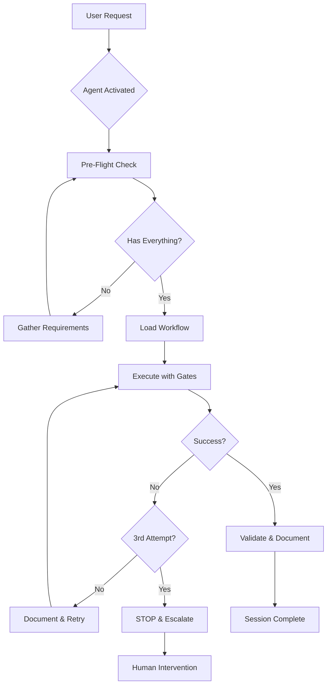

# Agent-Workflow Enforcement System
## Making Agents Honest, Accountable, and Equipped

### THE PROBLEM
- Agents can freestyle without workflows
- No accountability or tracking
- Missing context and tools
- Can ignore safety protocols

### THE SOLUTION: Three-Layer Enforcement

---

## Layer 1: AGENT CONTRACTS
Every agent MUST have a contract defining:

```yaml
agent_contract:
  agent_id: "api-developer"
  
  # What I promise to do
  commitments:
    - "Always gather context before acting"
    - "Document every change in changelog"
    - "Stop after 3 failed attempts"
    - "Never fix without root cause"
    
  # What I need to succeed
  requirements:
    - "Access to current error messages"
    - "Understanding of business logic"
    - "Rollback capability"
    - "Test environment"
    
  # How I can be verified
  accountability:
    success_metrics:
      - "Changes documented in changelog"
      - "Root cause identified before fix"
      - "No panic mode triggered"
    failure_indicators:
      - "Multiple rapid changes"
      - "No changelog entries"
      - "Breaking working code"
      
  # My workflow assignments
  workflow_participation:
    primary: ["api-development", "enhancement"]
    support: ["diagnostic", "modern-app-development"]
    forbidden: ["frontend-only-workflows"]
```

---

## Layer 2: WORKFLOW INTEGRATION MAP

### Every Agent MUST Have Workflows:

#### Current Orphan Agents (Need Workflows):
1. **app-structure-validator** → Create "structure-validation-workflow"
2. **refactoring-expert** → Create "refactoring-workflow" 
3. **main-dev-coordinator** → Create "coordination-workflow"
4. **app-auditor** → Create "audit-workflow"
5. **erpnext-app-cleaner** → Create "cleanup-workflow"
6. **documentation-specialist** → Create "documentation-workflow"
7. **jinja-template-specialist** → Create "template-workflow"
8. **mobile-ui-specialist** → Create "mobile-workflow"
9. **pwa-specialist** → Create "pwa-workflow"
10. **trigger-mapper** → Create "trigger-mapping-workflow"
11. **ui-layout-designer** → Create "ui-design-workflow"
12. **workspace-architect** → Create "workspace-workflow"
13. **app-scaffold-coordinator** → Create "scaffolding-workflow"

---

## Layer 3: AGENT CAPABILITY VERIFICATION

### Pre-Flight Check for EVERY Agent Activation:

```yaml
agent_preflight_check:
  context_verification:
    - working_directory: REQUIRED
    - active_app: REQUIRED
    - current_error: REQUIRED
    - recent_changes: REQUIRED
    
  tool_availability:
    - changelog_file: MUST_EXIST
    - git_access: VERIFIED
    - test_environment: READY
    - rollback_capability: CONFIRMED
    
  workflow_assignment:
    - primary_workflow: LOADED
    - safety_protocols: ENFORCED
    - decision_gates: UNDERSTOOD
    
  accountability_setup:
    - session_id: GENERATED
    - tracking_enabled: TRUE
    - panic_detection: ACTIVE
    - attempt_counter: INITIALIZED
```

---

## IMPLEMENTATION: Agent Honesty Framework

### 1. Forced Context Gathering
```yaml
# In EVERY agent's customization field:
customization: |
  HONESTY FRAMEWORK ACTIVE:
  
  BEFORE ANY ACTION, I MUST:
  1. Run context verification:
     - pwd && git status
     - tail -20 ../logs/frappe.log
     - echo "Current understanding: [state]"
  
  2. Document intent:
     - echo "## $(date): Planning to [action]" >> SESSION-LOG.md
     - echo "Because: [reasoning]" >> SESSION-LOG.md
  
  3. Verify capability:
     - "Do I have the tools needed?"
     - "Do I understand the business logic?"
     - "Do I have a rollback plan?"
  
  IF ANY CHECK FAILS: STOP AND REQUEST MISSING CONTEXT
```

### 2. Workflow-Enforced Stages
```yaml
# Every workflow MUST have:
universal_stages:
  - stage: "context_gathering"
    mandatory: true
    cannot_skip: true
    
  - stage: "root_cause_analysis"  
    mandatory: true
    cannot_proceed_without_documentation: true
    
  - stage: "solution_planning"
    requires_approval: true
    
  - stage: "controlled_implementation"
    panic_monitoring: active
    attempt_limit: 3
    
  - stage: "validation"
    success_criteria_required: true
```

### 3. Cross-Agent Verification
```yaml
agent_verification_matrix:
  api-developer:
    verified_by: ["api-architect", "testing-specialist"]
    must_coordinate_with: ["doctype-designer", "frappe-compliance-validator"]
    
  refactoring-expert:
    verified_by: ["erpnext-qa-lead", "testing-specialist"]
    must_coordinate_with: ["main-dev-coordinator"]
    
  diagnostic-specialist:
    verified_by: ["erpnext-architect"]
    must_coordinate_with: ["bench-operator", "testing-specialist"]
```

---

## KEEPING AGENTS EQUIPPED

### Every Agent Gets:

#### 1. Standard Toolkit
```bash
# Automatic tools available to ALL agents:
standard_toolkit:
  - gather_context.sh      # Context gathering script
  - create_changelog.sh     # Changelog initialization
  - verify_environment.sh   # Environment check
  - rollback_changes.sh     # Emergency rollback
  - detect_panic_mode.sh    # Self-monitoring
```

#### 2. Specialized Tools
```yaml
agent_specific_tools:
  api-developer:
    - check_endpoints.py
    - validate_permissions.py
    - test_api_calls.sh
    
  diagnostic-specialist:
    - analyze_logs.py
    - trace_error.sh
    - reproduce_issue.py
    
  refactoring-expert:
    - dependency_analyzer.py
    - impact_assessment.sh
    - safe_refactor.py
```

#### 3. Knowledge Access
```yaml
required_knowledge_files:
  all_agents:
    - MANDATORY-SAFETY-PROTOCOLS.md
    - agent-context-requirements.md
    - code-change-preflight-checklist.md
    
  agent_specific:
    api-developer:
      - api-whitelisting-guide.md
      - rest-best-practices.md
    diagnostic-specialist:
      - error-patterns-library.md
      - recovery-procedures.md
```

---

## ENFORCEMENT MECHANISMS

### 1. Workflow Gates
```yaml
enforcement_gates:
  pre_action:
    check: "Has context been gathered?"
    fail: "BLOCK - Return to context gathering"
    
  pre_fix:
    check: "Is root cause documented?"
    fail: "BLOCK - Cannot fix symptoms"
    
  pre_commit:
    check: "Is changelog updated?"
    fail: "BLOCK - Document changes first"
    
  panic_detection:
    check: "Multiple rapid changes?"
    fail: "EMERGENCY STOP - Rollback all"
```

### 2. Agent Scoring
```yaml
agent_performance_metrics:
  track_per_session:
    - context_gathering_completed: boolean
    - root_cause_found: boolean
    - first_attempt_success: boolean
    - changelog_maintained: boolean
    - panic_mode_triggered: boolean
    
  calculate_honesty_score:
    formula: "(documented_changes / total_changes) * 100"
    threshold: "Must be >= 90%"
```

### 3. Automatic Interventions
```yaml
intervention_triggers:
  on_third_failure:
    action: "Force stop and escalate"
    message: "3 attempts failed - switching to diagnostic mode"
    
  on_panic_detection:
    action: "Immediate rollback"
    message: "Panic mode detected - reverting all changes"
    
  on_missing_context:
    action: "Block progression"
    message: "Cannot proceed without required context"
```

---

## THE ACCOUNTABILITY CHAIN



---

## IMMEDIATE ACTIONS NEEDED

### 1. Create Missing Workflows (13 new workflows needed)
### 2. Update ALL Agent Customization Fields
### 3. Implement Pre-Flight Checks
### 4. Add Workflow Gates to All Existing Workflows
### 5. Create Cross-Agent Verification System

---

## SUCCESS METRICS

When this system works:
- ✅ 100% of agents have workflows
- ✅ 100% of changes are documented
- ✅ Zero panic-mode spirals
- ✅ Root cause found before fixes
- ✅ Agents have all required context
- ✅ Automatic safety enforcement
- ✅ Clear accountability trail

---

## THE BOTTOM LINE

**No agent works alone.**
**No agent works without a workflow.**
**No agent works without accountability.**
**No agent works without the tools they need.**

This is how we keep them honest and equipped.