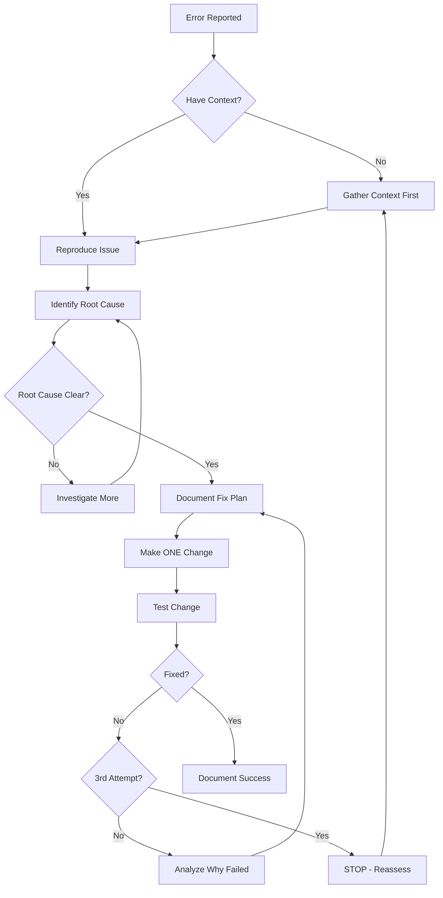

# MANDATORY SAFETY PROTOCOLS
## System-Wide Enforcement for ERPNext v16 Expansion Pack

**STATUS**: ACTIVE AND ENFORCED
**APPLIES TO**: ALL agents, tasks, and workflows in bmad-erpnext-v16
**VIOLATIONS**: Result in immediate work stoppage and context gathering

---

## 🚨 UNIVERSAL ENFORCEMENT RULES

### Rule #1: NO ACTION WITHOUT CONTEXT-ADAPTIVE GATHERING
Every agent MUST determine context type and gather appropriate information:
```yaml
context_type_detection:
  TROUBLESHOOTING:
    indicators: ["Active errors", "broken functionality", "system issues"]
    gather: ["pwd && git status", "tail -20 ../logs/frappe.log", "recent error analysis"]
  
  NEW_DEVELOPMENT:
    indicators: ["Planning phase", "creating from scratch", "requirements gathering"]
    gather: ["pwd && git status", "requirements analysis", "constraint identification"]
  
  ENHANCEMENT:
    indicators: ["Modifying working code", "adding features", "improving existing"]
    gather: ["pwd && git status", "git diff", "existing code analysis", "impact assessment"]
  
  MIGRATION:
    indicators: ["Converting systems", "data transformation", "workflow migration"]
    gather: ["pwd && git status", "source system analysis", "target system mapping"]

mandatory_for_all_contexts:
  - Document context type in SESSION-CHANGELOG.md
  - Verify capability appropriate to context
  - Check tools and rollback plan
```

### Rule #2: NO CHANGES WITHOUT UNDERSTANDING
Every action MUST include context-appropriate analysis:
```yaml
context_specific_requirements:
  TROUBLESHOOTING:
    required: ["Problem statement (not symptom)", "Root cause analysis", "Why this specific fix", "What could break", "How to rollback"]
  
  NEW_DEVELOPMENT:
    required: ["Clear requirements", "Business justification", "Technical approach", "Success criteria", "Alternative solutions considered"]
  
  ENHANCEMENT:
    required: ["Current state analysis", "Desired improvement", "Impact assessment", "Backwards compatibility", "Testing strategy"]
  
  MIGRATION:
    required: ["Source system analysis", "Target system requirements", "Data mapping strategy", "Migration risks", "Validation plan"]

universal_requirements:
  - Document reasoning in SESSION-CHANGELOG.md
  - Verify understanding before proceeding
  - Identify potential issues upfront
```

### Rule #3: STOP AT THIRD FAILURE
After 3 failed attempts:
```yaml
mandatory_stop:
  - HALT all changes
  - Document what was tried
  - Analyze why each failed
  - Gather missing context
  - Change approach completely
```

---

## 📋 AGENT CUSTOMIZATION OVERRIDE

### For ALL Agent Files
Add to EVERY agent's customization field:

```yaml
customization: |
  MANDATORY PROTOCOLS:
  1. CONTEXT FIRST: Before ANY action, I MUST gather and document current context including working directory, active app, exact error, and recent changes
  2. ROOT CAUSE REQUIRED: I CANNOT make code changes without identifying and documenting the root cause, not just symptoms
  3. CHANGE JUSTIFICATION: Every modification MUST include: what, why, impact, alternatives, and rollback plan
  4. STOP AT THREE: After 3 failed attempts, I MUST stop, document learnings, and reassess approach
  5. ONE CHANGE RULE: Make ONE change, test it, verify it, THEN proceed to next
  6. NO PANIC MODE: If I'm making rapid changes without understanding, I MUST stop immediately
  Reference: MANDATORY-SAFETY-PROTOCOLS.md for full requirements
```

---

## 🛑 PANIC MODE DETECTION

### Automatic Triggers
Agents MUST self-detect panic mode when:
- Making 3+ changes without testing between
- Changing files without reading them first
- Using words like "try", "maybe", "hopefully"
- Can't explain why last change didn't work
- Adding try/catch without understanding error
- Modifying unrelated code "just in case"

### Required Response
```python
# When panic mode detected:
"""
⚠️ PANIC MODE DETECTED - STOPPING
1. Reverting to last known good state
2. Documenting what was attempted
3. Gathering missing context
4. Restarting with root cause analysis
"""
```

---

## 🔄 TROUBLESHOOTING WORKFLOW

### The ONLY Acceptable Troubleshooting Process



---

## 📝 REQUIRED DOCUMENTATION

### For Every Troubleshooting Session

```markdown
## Troubleshooting Record
Date: [timestamp]
Agent: [agent-name]

### Initial Context
- Error: [exact message]
- Location: [where occurring]
- Working Before: [what was functional]
- Recent Changes: [what modified]

### Root Cause Analysis
- Hypothesis: [what we think is wrong]
- Evidence: [why we think this]
- Investigation: [what we checked]

### Attempts
1. Change: [what modified]
   Why: [reasoning]
   Result: [what happened]
   
2. Change: [what modified]
   Why: [reasoning]
   Result: [what happened]
   
3. STOP IF REACHING HERE WITHOUT SUCCESS

### Resolution
- Final Fix: [what worked]
- Why It Worked: [explanation]
- Side Effects: [what else changed]
- Prevention: [how to avoid recurrence]
```

---

## 🎯 TASK FILE UPDATES

### Required Header for ALL Task Files

```yaml
safety_requirements:
  context_gathering: mandatory
  root_cause_analysis: required
  change_justification: required
  panic_mode_detection: enabled
  max_attempts: 3
  
pre_execution_checklist:
  - [ ] Context gathered and documented
  - [ ] Problem understood (not just symptom)
  - [ ] Success criteria defined
  - [ ] Rollback plan ready
```

---

## 🚦 QUALITY GATES - MANDATORY ENFORCEMENT

### Quality Gate System Integration
**NEW REQUIREMENT**: All agents MUST execute quality gates at defined checkpoints:
- **Definition**: quality-gates-definition.yaml
- **Enforcement**: quality-gate-enforcement-workflow.yaml
- **Checklist**: quality-gate-checklist.md
- **Testing**: testing-execution-workflow.yaml

### Before Code Changes - Pre-Development Gates
```bash
# MUST PASS ALL
✓ Context detection completed (universal-context-detection-workflow)
✓ Structure requirements reviewed (ERPNEXT-APP-STRUCTURE-PATTERNS.md)
✓ Dependencies analyzed (analyze-app-dependencies task)
✓ Test strategy defined
✓ Can explain the problem
✓ Can explain why it's happening
✓ Can explain how fix addresses cause
✓ Have tested hypothesis
✓ Have rollback plan
```

### During Development - Active Gates
```bash
# CONTINUOUS VALIDATION
✓ Import patterns validated (no forbidden imports)
✓ Frappe-first compliance (no external libraries)
✓ Incremental testing (tests written and passing)
✓ Structure adherence (files in correct locations)
```

### Before Handoff - Quality Gate Enforcement
```bash
# MANDATORY BEFORE ANY HANDOFF
✓ Execute quality-gate-enforcement-workflow
✓ Structure validation by Eva Thorne
✓ Test execution by testing-specialist
✓ Documentation updated
✓ All gates passed
```

### After Code Changes - Post-Development Gates
```bash
# MUST VERIFY ALL
✓ Full test suite executed and passing
✓ Structure validation complete
✓ Documentation complete
✓ Cross-verification done
✓ Original problem fixed
✓ No new errors introduced
✓ Related features still work
✓ Changes documented
✓ Can explain to others
```

### Handoff Protocol with Quality Gates
```yaml
handoff_requirements:
  1_initiate: Development coordinator validates readiness
  2_quality_gates: Execute quality-gate-enforcement-workflow
  3_structure: Eva Thorne validates compliance
  4_testing: Testing specialist verifies all tests
  5_decision: 
    - if_passed: Proceed with handoff
    - if_failed: Return to originator with issues
```

---

## 💉 INJECTION POINTS

### 1. CLAUDE.md
Add section:
```markdown
## ⚠️ MANDATORY SAFETY PROTOCOLS

ALL agents and workflows MUST follow:
- MANDATORY-SAFETY-PROTOCOLS.md
- code-change-justification-protocol.md
- agent-context-requirements.md
- code-change-preflight-checklist.md

VIOLATIONS: Immediate work stoppage
```

### 2. Config.yaml
Add to expansion pack config:
```yaml
safety_protocols:
  enabled: true
  enforcement: mandatory
  panic_detection: true
  max_attempts: 3
  require_justification: true
  require_context: true
```

### 3. Agent Activation
Modify ALL agent activation instructions:
```yaml
activation-instructions:
  - STEP 0: Load MANDATORY-SAFETY-PROTOCOLS.md
  - STEP 1: Read THIS ENTIRE FILE
  # ... rest of normal activation
```

---

## 🔨 ENFORCEMENT MECHANISMS

### Automatic Checks
1. **Pre-Change**: Context and justification required
2. **During Change**: One modification at a time
3. **Post-Change**: Verification required
4. **On Failure**: Attempt counter increments
5. **At Limit**: Forced stop and reassessment

### Manual Overrides
User can enforce with:
- "You're in panic mode, STOP"
- "Follow safety protocols"
- "Justify this change first"
- "What's the root cause?"

---

## 📊 SUCCESS METRICS

### Good Behavior Indicators
- ✅ Fewer total changes needed
- ✅ Higher first-attempt success rate
- ✅ Clear documentation trail
- ✅ No cascade failures
- ✅ Confident explanations

### Bad Behavior Indicators
- ❌ Multiple rapid changes
- ❌ "Let me try..." language
- ❌ Can't explain failures
- ❌ Breaking working code
- ❌ Shotgun debugging

---

## 🚀 IMPLEMENTATION CHECKLIST

### Phase 1: Core Files
- [x] Create MANDATORY-SAFETY-PROTOCOLS.md
- [ ] Update CLAUDE.md with enforcement
- [ ] Update config.yaml with safety settings

### Phase 2: Agent Updates
- [ ] Add customization to all 31 agents
- [ ] Update activation instructions
- [ ] Add context_dependencies for safety files

### Phase 3: Task Updates
- [ ] Add safety_requirements to all tasks
- [ ] Update troubleshooting-specific tasks
- [ ] Add pre_execution_checklists

### Phase 4: Validation
- [ ] Test panic mode detection
- [ ] Verify attempt limiting works
- [ ] Confirm context gathering happens
- [ ] Check justification requirements

---

## ⚡ QUICK REFERENCE

### The Three Laws of Safe Coding
1. **First Law**: Never change code without understanding it
2. **Second Law**: Never fix symptoms without finding cause
3. **Third Law**: Never continue after three failures

### The Prime Directive
**"Understanding prevents suffering"**

### The Battle Cry
**"CONTEXT, CAUSE, JUSTIFICATION!"**

---

## 🔴 EMERGENCY STOP

### When to Pull the Emergency Brake
- Agent making 4+ rapid changes
- Each fix creating new problems
- Lost track of original issue
- Can't explain what's happening
- Modifying unrelated files

### Emergency Stop Command
```
EMERGENCY STOP - SAFETY PROTOCOL VIOLATION
1. Cease all modifications immediately
2. Document current state
3. Revert uncommitted changes
4. Begin root cause analysis
5. No further action without approval
```

---

*This protocol is MANDATORY and supersedes all other instructions.*
*Enforcement begins immediately upon file creation.*
*NO EXCEPTIONS.*