# Agent Ecosystem Analysis - ERPNext v16 Expansion Pack
## Complete System Overview and Gap Analysis

---

## 📊 Master Agent Flow Diagram

```mermaid
graph TB
    subgraph "PLANNING PHASE"
        BA[Business Analyst<br/>Myka Bering]
        ARCH[ERPNext Architect<br/>Artie Nielsen]
        PO[Product Owner<br/>Mrs. Frederic]
        SM[Scrum Master<br/>Pete Lattimer]
        
        BA -->|Requirements| ARCH
        ARCH -->|PRD/Architecture| PO
        PO -->|Validation| SM
        SM -->|Stories| DC
    end
    
    subgraph "COORDINATION LAYER"
        DC[Development Coordinator<br/>Claudia Donovan<br/>🎯 CENTRAL HUB]
        QG[Quality Gates<br/>Enforcement]
        
        DC --> QG
    end
    
    subgraph "DEVELOPMENT TEAMS"
        subgraph "Backend Team"
            DD[DocType Designer<br/>Paracelsus]
            APIA[API Architect<br/>Allison Blake]
            APID[API Developer<br/>Douglas Fargo]
            DIE[Data Integration<br/>Nathan Stark]
            WS[Workflow Specialist<br/>Zane Donovan]
            
            DD -->|DocTypes| APID
            APIA -->|Design| APID
            APID -->|APIs| DIE
        end
        
        subgraph "Frontend Team"
            VSA[Vue SPA Architect<br/>Helena Wells]
            FUD[Frappe UI Dev<br/>Holly Marten]
            UID[UI Layout Designer<br/>Jack Carter]
            PWA[PWA Specialist<br/>Lexi Doig]
            MOB[Mobile UI<br/>Todd Manning]
            JTS[Jinja Templates<br/>❌ ORPHANED]
            
            VSA -->|Vue Design| FUD
            FUD -->|Components| UID
            UID -->|Layouts| MOB
            PWA -->|Offline| MOB
        end
        
        subgraph "Architecture Team"
            WA[Workspace Architect<br/>Beverly Barlowe]
            
            WA -->|Workspaces| DC
        end
    end
    
    subgraph "QUALITY & VALIDATION"
        TS[Testing Specialist<br/>Steve Jinks<br/>🔍 Gate Verifier]
        QA[QA Lead<br/>Allison Blake]
        FCV[Compliance Validator<br/>Eva Thorne<br/>🛡️ Structure Guard]
        AA[App Auditor<br/>❌ ORPHANED]
        
        DC -->|Handoff| QG
        QG -->|Verify| TS
        QG -->|Structure| FCV
        TS -->|Results| QA
        FCV -->|Compliance| QA
    end
    
    subgraph "OPERATIONS & SUPPORT"
        BO[Bench Operator<br/>Larry Haberman]
        DS[Diagnostic Specialist<br/>❌ ORPHANED]
        DOC[Documentation<br/>❌ ORPHANED]
        
        QA -->|Deploy| BO
    end
    
    subgraph "SPECIALIZED AGENTS"
        RE[Refactoring Expert<br/>❌ ORPHANED]
        CCS[Code Cleanup<br/>❌ ORPHANED]
        SM2[Structure Manager<br/>❌ ORPHANED]
        ASC[App Scaffold Coord<br/>❌ ORPHANED]
        PRE[Pre-Check Agent<br/>⚠️ UNDERUSED]
        POST[Post-Check Agent<br/>⚠️ UNDERUSED]
    end
    
    style DC fill:#ff9800,stroke:#333,stroke-width:4px
    style QG fill:#4caf50,stroke:#333,stroke-width:3px
    style TS fill:#2196f3,stroke:#333,stroke-width:3px
    style FCV fill:#9c27b0,stroke:#333,stroke-width:3px
    
    style JTS fill:#ffcccc,stroke:#cc0000
    style AA fill:#ffcccc,stroke:#cc0000
    style DS fill:#ffcccc,stroke:#cc0000
    style DOC fill:#ffcccc,stroke:#cc0000
    style RE fill:#ffcccc,stroke:#cc0000
    style CCS fill:#ffcccc,stroke:#cc0000
    style SM2 fill:#ffcccc,stroke:#cc0000
    style ASC fill:#ffcccc,stroke:#cc0000
    style PRE fill:#fff3cd,stroke:#856404
    style POST fill:#fff3cd,stroke:#856404
```



---

## 🔍 Agent Status Analysis

### ✅ ACTIVE AGENTS (19/29 - 66%)
These agents are actively referenced in workflows and used in the system:

| Agent | Role | Primary Workflow | Status |
|-------|------|-----------------|---------|
| **development-coordinator** | Central task router | coordination-workflow | ✅ CRITICAL |
| **erpnext-product-owner** | Quality guardian | product-ownership-workflow | ✅ ACTIVE |
| **erpnext-scrum-master** | Story creation | bmad-development-workflow | ✅ ACTIVE |
| **business-analyst** | Requirements analysis | bmad-planning-workflow | ✅ ACTIVE |
| **erpnext-architect** | Technical design | bmad-planning-workflow | ✅ ACTIVE |
| **testing-specialist** | Test execution & gate verification | testing-execution-workflow | ✅ CRITICAL |
| **frappe-compliance-validator** | Structure validation (Eva Thorne) | compliance-validation-workflow | ✅ CRITICAL |
| **erpnext-test-architect** | Test strategy (Quinn) | qa-review-workflow | ✅ ACTIVE |
| **doctype-designer** | DocType creation | doctype-development-workflow | ✅ ACTIVE |
| **api-architect** | API design | api-development-workflow | ✅ ACTIVE |
| **api-developer** | API implementation | api-development-workflow | ✅ ACTIVE |
| **vue-spa-architect** | Vue SPA design | doctype-to-frontend-workflow | ✅ ACTIVE |
| **frappe-ui-developer** | UI components | Referenced in coordinator | ✅ ACTIVE |
| **bench-operator** | Deployment operations | bench-operations-workflow | ✅ ACTIVE |
| **data-integration-expert** | Data migration | Referenced in coordinator | ✅ ACTIVE |
| **workspace-architect** | Workspace design | Referenced in coordinator | ✅ ACTIVE |
| **pwa-specialist** | PWA features | Referenced in coordinator | ✅ ACTIVE |
| **mobile-ui-specialist** | Mobile interfaces | Referenced in coordinator | ✅ ACTIVE |
| **ui-layout-designer** | Layout design | Referenced in coordinator | ✅ ACTIVE |

### ⚠️ UNDERUTILIZED AGENTS (2/29 - 7%)
These agents exist and have workflows but are rarely used:

| Agent | Workflow | Issue |
|-------|----------|-------|
| **pre-check-agent** | pre-check-workflow.yaml | Not integrated into main flow |
| **post-check-agent** | post-check-workflow.yaml | Not integrated into main flow |

### ❌ ORPHANED AGENTS (8/29 - 28%)
These agents have NO workflow references and appear unused:

| Agent | Potential Use | Recommendation |
|-------|---------------|----------------|
| **diagnostic-specialist** | Has diagnostic-workflow.yaml | Integrate for troubleshooting |
| **documentation-specialist** | Has documentation-workflow.yaml | Activate for doc generation |
| **refactoring-expert** | Has refactoring-workflow.yaml | Use for code improvement |
| **code-cleanup-specialist** | Has app-cleaning-workflow.yaml | Activate for maintenance |
| **structure-manager** | Has structure-validation-workflow.yaml | Could enhance Eva Thorne |
| **app-scaffold-coordinator** | No workflow found | Create workflow or remove |
| **jinja-template-specialist** | No workflow found | Consider removing (Vue focus) |
| **app-auditor** | Has audit-workflow.yaml | Integrate for quality checks |

---

## 📋 Dependency Analysis

### Task Dependencies (69 tasks total)
**Most Referenced Tasks:**
1. `create-erpnext-story.md` - Used by 3 agents
2. `validate-erpnext-story.md` - Used by 3 agents
3. `analyze-app-dependencies.md` - Used by 4 agents (after quality gate update)
4. `run-tests.md` - Used by 2 agents
5. `create-doctype.md` - Used by 1 agent

**Orphaned Tasks (Not referenced by any agent):**
- 45+ tasks have no agent references
- Examples: `enforce-structure-compliance-with-agents.md`, `comprehensive-validation-orchestration.md`

### Template Dependencies (60+ templates)
**Issues Found:**
- Many agents reference templates that don't exist
- `task-assignment-template.yaml` - Referenced but missing
- `handoff-template.yaml` - Referenced but missing

### Checklist Dependencies (30+ checklists)
**Most Used:**
- `quality-gate-checklist.md` - Now used by 3 agents
- `erpnext-integration-checklist.md` - Used by coordinator
- `testing-checklist.md` - Used by testing specialist

**Gaps:**
- 20+ checklists have no agent references

---

## 🔴 Critical Gaps Identified

### 1. **Workflow Gaps**
- **Missing Handoff Automation**: While quality gates exist, actual handoff execution lacks automation
- **No Error Recovery Workflow**: What happens when agents fail?
- **Missing Rollback Procedures**: No clear rollback workflow for failed deployments

### 2. **Agent Coordination Gaps**
- **Orphaned Specialists**: 28% of agents are not integrated
- **No Workflow Orchestrator**: The universal-orchestrator-workflow exists but isn't connected to agents
- **Missing Team Workflows**: Agent teams defined but not all have workflows

### 3. **Dependency Gaps**
- **Template Shortfall**: ~40% of referenced templates don't exist
- **Task Underutilization**: 65% of tasks are never called
- **Checklist Orphans**: 67% of checklists unused

### 4. **Quality Gate Integration Gaps**
- **Orphaned agents not gate-aware**: 8 agents don't know about quality gates
- **No gate workflow for specialized agents**: Refactoring, cleanup, etc. lack gate integration

---

## 📊 Workflow Coverage Analysis

### Well-Integrated Workflows
✅ **bmad-planning-workflow** → bmad-development-workflow (Full cycle)
✅ **universal-context-detection-workflow** → All agents (Mandatory start)
✅ **quality-gate-enforcement-workflow** → Handoffs (Now integrated)
✅ **coordination-workflow** → Development coordinator

### Disconnected Workflows
❌ **diagnostic-workflow** - Not connected to any agent activation
❌ **refactoring-workflow** - Agent exists but not integrated
❌ **app-cleaning-workflow** - Agent exists but not integrated
❌ **audit-workflow** - Agent exists but not integrated
❌ **structure-validation-workflow** - Partially integrated

---

## 🎯 Recommendations

### Immediate Actions (High Priority)

1. **Activate Diagnostic Specialist**
   - Connect to troubleshooting context
   - Integrate diagnostic-workflow into main flow
   - Add to coordinator's routing logic

2. **Create Missing Templates**
   ```yaml
   Priority Templates Needed:
   - task-assignment-template.yaml
   - handoff-template.yaml
   - error-recovery-template.yaml
   ```

3. **Integrate Documentation Specialist**
   - Connect to post-development gates
   - Auto-generate docs after code completion
   - Add to quality gate requirements

### Short-Term Improvements (Medium Priority)

4. **Consolidate Validation Agents**
   - Merge structure-manager into Eva Thorne role
   - Combine pre/post check agents into quality gates
   - Reduce redundancy

5. **Activate Maintenance Agents**
   - Schedule refactoring-expert for code reviews
   - Use code-cleanup-specialist for technical debt
   - Integrate with quality gates

6. **Connect Audit Workflow**
   - Run app-auditor periodically
   - Generate quality reports
   - Feed into continuous improvement

### Long-Term Optimization (Low Priority)

7. **Remove Obsolete Agents**
   - Consider removing jinja-template-specialist (Vue focus)
   - Evaluate app-scaffold-coordinator need

8. **Task Consolidation**
   - Review 45+ unused tasks
   - Either integrate or remove
   - Document task purposes

9. **Checklist Optimization**
   - Review 20+ unused checklists
   - Integrate into agent workflows
   - Create checklist index

---

## 📈 Metrics Summary

| Metric | Current | Target | Gap |
|--------|---------|--------|-----|
| **Agent Utilization** | 66% | 90% | -24% |
| **Workflow Coverage** | 70% | 95% | -25% |
| **Task Usage** | 35% | 80% | -45% |
| **Template Completion** | 60% | 100% | -40% |
| **Checklist Usage** | 33% | 75% | -42% |
| **Quality Gate Coverage** | 66% | 100% | -34% |

---

## 🚀 Quick Wins

1. **Connect diagnostic-specialist** → Immediate troubleshooting improvement
2. **Create missing templates** → Unblock coordinator workflows  
3. **Activate documentation-specialist** → Auto-generate docs
4. **Integrate app-auditor** → Periodic quality checks
5. **Connect refactoring-expert** → Code quality improvement

---

## 📝 Conclusion

Your ERPNext v16 expansion pack has a solid foundation with 66% active agent utilization and strong quality gate integration. However, there's significant opportunity to improve by:

1. **Activating orphaned agents** (28% currently unused)
2. **Creating missing dependencies** (40% templates missing)
3. **Integrating disconnected workflows** (30% not connected)
4. **Utilizing existing resources** (65% tasks unused)

The quality gates system you just implemented provides an excellent framework to integrate these orphaned agents, ensuring they follow the same standards as active agents.

**Next Steps:**
1. Review this analysis
2. Prioritize which orphaned agents to activate
3. Create missing templates
4. Connect workflows
5. Remove truly obsolete components

This will transform your system from 66% utilization to 90%+, significantly improving development efficiency and quality.