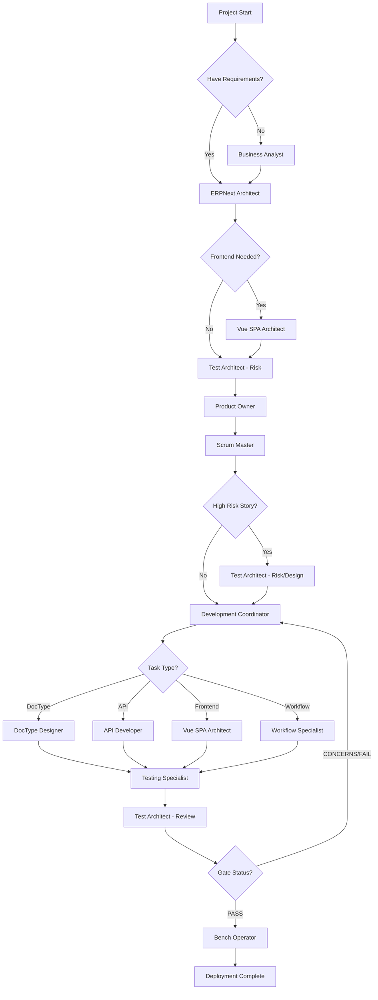

# ERPNext Agent & File Stage Guide

This guide shows exactly which agents to use at each stage of development and what files they should work with for optimal results.

## Quick Reference Table

| Stage | Primary Agent | Supporting Agents | Key Files | Output Files |
|-------|--------------|-------------------|-----------|--------------|
| Business Analysis | business-analyst | - | Market research, Process docs | `docs/brief.md` |
| Requirements | erpnext-architect | business-analyst | `docs/brief.md` | `docs/prd.md` |
| Architecture | erpnext-architect | vue-spa-architect | `docs/prd.md` | `docs/architecture.md` |
| Risk Assessment | erpnext-test-architect | - | `docs/prd.md`, `docs/architecture.md` | `docs/qa/assessments/*-risk.md` |
| Validation | erpnext-product-owner | - | `docs/prd.md`, `docs/architecture.md` | Validated docs |
| Sharding | erpnext-product-owner | - | `docs/prd.md`, `docs/architecture.md` | `docs/epics/`, `docs/stories/` |
| Story Creation | erpnext-scrum-master | erpnext-test-architect | `docs/epics/*.md` | `docs/stories/*.md` |
| Development | development-coordinator | Multiple specialists | `docs/stories/*.md` | App code files |
| Testing | testing-specialist | erpnext-test-architect | App code files | Test files, QA reports |
| Review | erpnext-test-architect | - | All code files | `docs/qa/gates/*.yml` |

---

## Stage 1: Business Analysis (Optional but Recommended)

### Primary Agent: `business-analyst`

**When to Use**: Starting a new project without clear requirements

**Commands**:
```bash
@business-analyst
*analyze-business "Your business domain and needs"
*identify-processes "Core business processes"
*map-to-erpnext "Map processes to ERPNext modules"
*create-brief
```

**Input Files**:
- External research documents
- Existing process documentation
- Competitor analysis
- User interviews/feedback

**Output Files**:
```
docs/
├── brief.md                 # Business brief
├── process-maps/            # Process diagrams
└── requirements-raw.md      # Raw requirements
```

**Success Criteria**:
- Clear understanding of business needs
- Identified ERPNext modules to use/extend
- Documented pain points and opportunities

---

## Stage 2: Requirements Definition

### Primary Agent: `erpnext-architect`

**When to Use**: Creating formal requirements from business brief

**Commands**:
```bash
@erpnext-architect

# If you have a brief
*generate-prd --input "docs/brief.md"

# If starting fresh (interactive)
*generate-prd
```

**Input Files**:
```
docs/
├── brief.md                 # From business analysis
└── requirements-raw.md      # Unstructured requirements
```

**Output Files**:
```
docs/
├── prd.md                   # Product Requirements Document
│   ├── Functional Requirements
│   ├── Non-Functional Requirements
│   ├── User Stories
│   ├── DocType Definitions
│   └── API Requirements
└── diagrams/
    └── system-overview.png  # System diagram
```

**PRD Structure Example**:
```markdown
# PRD: [App Name]

## 1. Functional Requirements
- FR001: User Management
- FR002: Data Entry Forms
- FR003: Reporting

## 2. Non-Functional Requirements
- NFR001: Performance (< 2s load time)
- NFR002: Security (Role-based access)
- NFR003: Scalability (10,000+ records)

## 3. DocTypes Required
- DocType1: Customer Extension
- DocType2: Custom Transaction

## 4. APIs Required
- API001: GET /api/custom/list
- API002: POST /api/custom/create

## 5. Integrations
- ERP Modules: Sales, Stock
- External: Payment Gateway
```

---

## Stage 3: Technical Architecture

### Primary Agent: `erpnext-architect`
### Supporting Agent: `vue-spa-architect` (if frontend needed)

**When to Use**: Designing technical implementation

**Commands**:
```bash
@erpnext-architect
*design-architecture --prd "docs/prd.md"

# If Vue frontend needed
@vue-spa-architect
*create-frontend-spec --prd "docs/prd.md"
```

**Input Files**:
```
docs/
├── prd.md                   # Requirements
└── frontend-spec.md         # If Vue needed
```

**Output Files**:
```
docs/
├── architecture.md          # Technical architecture
│   ├── System Design
│   ├── DocType Schemas
│   ├── API Specifications
│   ├── Database Design
│   ├── Integration Points
│   └── Security Model
├── schemas/
│   ├── doctype1.yaml       # DocType definitions
│   └── doctype2.yaml
└── api-specs/
    └── openapi.yaml         # API documentation
```

**Architecture Structure**:
```yaml
# architecture.md structure
system:
  modules:
    - name: Equipment Management
      doctypes: [Equipment, Equipment Type]
      apis: [equipment_api]
      
doctypes:
  Equipment:
    fields:
      - name: equipment_code
        type: Data
        required: true
      - name: equipment_type
        type: Link
        options: Equipment Type
        
apis:
  equipment_api:
    endpoints:
      - method: GET
        path: /api/equipment/list
        params: [type, status]
```

---

## Stage 4: Risk Assessment (Optional but Recommended)

### Primary Agent: `erpnext-test-architect`

**When to Use**: Before development starts, especially for complex features

**Commands**:
```bash
@qa
*risk --prd "docs/prd.md"
*design --architecture "docs/architecture.md"
```

**Input Files**:
```
docs/
├── prd.md
├── architecture.md
└── epics/                   # If already sharded
```

**Output Files**:
```
docs/qa/assessments/
├── project-risk-20240315.md
├── test-design-20240315.md
└── risk-matrix.yaml
```

**Risk Assessment Content**:
- Security risks (score 1-9)
- Performance risks
- Data integrity risks
- Integration risks
- Mitigation strategies

---

## Stage 5: Document Validation & Sharding

### Primary Agent: `erpnext-product-owner`

**When to Use**: Before development begins

**Commands**:
```bash
@erpnext-product-owner

# Validate alignment
*execute-checklist-po

# Shard into epics
*shard-doc "docs/prd.md" "docs/epics/"

# Shard architecture 
*shard-doc "docs/architecture.md" "docs/technical/"
```

**Input Files**:
```
docs/
├── prd.md                   # Complete PRD
├── architecture.md          # Complete architecture
└── qa/assessments/          # Risk assessments
```

**Output Files**:
```
docs/
├── epics/
│   ├── epic-001-user-management.md
│   ├── epic-002-core-features.md
│   └── epic-003-reporting.md
├── technical/
│   ├── tech-001-doctypes.md
│   ├── tech-002-apis.md
│   └── tech-003-frontend.md
└── validation-report.md
```

---

## Stage 6: Story Creation

### Primary Agent: `erpnext-scrum-master`
### Supporting Agent: `erpnext-test-architect` (for high-risk stories)

**When to Use**: Beginning of each sprint/development cycle

**Commands**:
```bash
@erpnext-scrum-master
*draft --epic "docs/epics/epic-001.md"

# For high-risk stories
@qa
*risk --story "draft-story"
*design --story "draft-story"
```

**Input Files**:
```
docs/
├── epics/*.md               # Sharded epics
├── technical/*.md           # Technical specs
└── qa/assessments/          # Risk profiles
```

**Output Files**:
```
docs/stories/
├── epic-001.story-001.md    # Create User DocType
├── epic-001.story-002.md    # User permissions
└── epic-001.story-003.md    # User API endpoints
```

**Story Template**:
```markdown
# Story: [Title]
Epic: epic-001
Priority: High
Risk: Medium

## Acceptance Criteria
1. DocType created with fields
2. Permissions configured
3. Tests written
4. API endpoints working

## Technical Tasks
1. Create DocType schema
2. Implement controller
3. Add permissions
4. Create tests

## Definition of Done
- [ ] Code complete
- [ ] Tests passing
- [ ] Code reviewed
- [ ] Documentation updated
```

---

## Stage 7: Development Implementation

### Primary Agent: `development-coordinator`
### Specialist Agents: Based on task type

**When to Use**: Implementing each story

**Commands**:
```bash
@development-coordinator
*route-task "Create Equipment DocType with rental fields"
# Output: "Routing to doctype-designer"

# Then work with specialists
@doctype-designer
*create-doctype "Equipment"

@api-developer
*create-api "Equipment CRUD operations"

@vue-spa-architect
*create-component "Equipment list view"
```

**Task Routing Map**:

| Task Type | Primary Agent | Supporting Agents |
|-----------|--------------|-------------------|
| DocType Creation | doctype-designer | data-integration-expert |
| API Development | api-developer | api-architect |
| Frontend Vue | vue-spa-architect | frappe-ui-developer |
| Mobile UI | mobile-ui-specialist | pwa-specialist |
| Workflows | workflow-specialist | - |
| Testing | testing-specialist | - |
| Integration | data-integration-expert | - |

**Input Files Per Specialist**:

**DocType Designer**:
```
docs/
├── stories/current-story.md
├── technical/tech-001-doctypes.md
└── schemas/doctype-schema.yaml
```

**API Developer**:
```
docs/
├── stories/current-story.md
├── technical/tech-002-apis.md
├── api-specs/openapi.yaml
└── app/doctypes/          # Created DocTypes
```

**Vue SPA Architect**:
```
docs/
├── stories/current-story.md
├── frontend-spec.md
├── ui-mockups/
└── app/api/              # Backend APIs
```

**Output Files**:
```
app_name/
├── app_name/
│   ├── doctype/
│   │   └── equipment/
│   │       ├── equipment.py
│   │       ├── equipment.json
│   │       └── test_equipment.py
│   ├── api/
│   │   └── equipment.py
│   └── public/
│       └── js/
│           └── equipment/
│               └── EquipmentList.vue
```

---

## Stage 8: Testing

### Primary Agent: `testing-specialist`
### Supporting Agent: `erpnext-test-architect`

**When to Use**: After code implementation

**Commands**:
```bash
@testing-specialist
*create-tests "Equipment DocType and APIs"
*run-tests

# Mid-development checks
@qa
*trace --story "current-story"    # Check coverage
*nfr --story "current-story"      # Check quality
```

**Input Files**:
```
app_name/
├── doctype/*/                    # All DocTypes
├── api/*.py                      # All APIs
├── public/js/                    # Frontend code
└── docs/stories/current-story.md # Requirements
```

**Output Files**:
```
app_name/
├── tests/
│   ├── test_equipment.py
│   ├── test_api.py
│   └── test_integration.py
└── docs/qa/
    ├── assessments/
    │   ├── story-trace-*.md
    │   └── story-nfr-*.md
    └── test-reports/
        └── coverage.html
```

---

## Stage 9: Code Review

### Primary Agent: `erpnext-test-architect`

**When to Use**: Story marked as complete

**Commands**:
```bash
@qa
*review --story "epic-001.story-001"

# Updates quality gate
*gate --story "epic-001.story-001"
```

**Input Files**:
```
# ALL files related to the story
app_name/                        # Complete codebase
docs/stories/current-story.md    # Story requirements
tests/                           # Test files
```

**Output Files**:
```
docs/
├── stories/
│   └── epic-001.story-001.md   # Updated with QA Results
└── qa/
    └── gates/
        └── epic-001.story-001-20240315.yml
```

**Gate Decision Criteria**:
- PASS: All requirements met, tests passing
- CONCERNS: Minor issues, non-critical gaps
- FAIL: Critical issues, security risks
- WAIVED: Accepted risks with justification

---

## Stage 10: Deployment

### Primary Agent: `bench-operator`
### Supporting Agent: `testing-specialist`

**When to Use**: After stories pass review

**Commands**:
```bash
@bench-operator
*build --app "app_name"
*migrate --site "site-name"
*run-tests --app "app_name"
*deploy --production
```

**Input Files**:
```
app_name/                        # Complete app
deployment/
├── config.yaml                  # Deployment config
└── requirements.txt             # Dependencies
```

**Output Files**:
```
logs/
├── build.log
├── migration.log
└── deployment.log
```

---

## Optimal File Organization

### Recommended Project Structure

```
project-root/
├── docs/                        # All documentation
│   ├── brief.md                # Business brief
│   ├── prd.md                  # Requirements
│   ├── architecture.md         # Technical design
│   ├── epics/                  # Sharded epics
│   │   ├── epic-001.md
│   │   └── epic-002.md
│   ├── stories/                # User stories
│   │   ├── epic-001.story-001.md
│   │   └── epic-001.story-002.md
│   ├── technical/              # Technical specs
│   │   ├── doctypes.md
│   │   └── apis.md
│   └── qa/                     # Quality assurance
│       ├── assessments/        # Risk & test docs
│       └── gates/              # Quality gates
│
├── app_name/                   # ERPNext app
│   ├── app_name/
│   │   ├── doctypes/          # DocType definitions
│   │   ├── api/               # API endpoints
│   │   ├── public/            # Frontend assets
│   │   │   └── js/           # Vue components
│   │   └── templates/         # Jinja templates
│   ├── tests/                 # Test files
│   └── fixtures/              # Data fixtures
│
└── deployment/                 # Deployment configs
    ├── production.yaml
    └── staging.yaml
```

---

## Agent Selection Decision Tree



---

## Common Pitfalls & Solutions

### Pitfall 1: Skipping Business Analysis
**Problem**: Unclear requirements lead to rework  
**Solution**: Always start with business-analyst even for 30 minutes

### Pitfall 2: Not Sharding Documents
**Problem**: Overwhelming context for agents  
**Solution**: Always use product-owner to shard before development

### Pitfall 3: Wrong Agent for Task
**Problem**: API developer trying to create DocTypes  
**Solution**: Use development-coordinator to route tasks

### Pitfall 4: Missing Risk Assessment
**Problem**: Critical issues found late  
**Solution**: Run test-architect risk assessment early

### Pitfall 5: Incomplete Testing
**Problem**: Bugs in production  
**Solution**: Use test-architect trace command during development

---

## Quick Start Commands

### For New App
```bash
# 1. Business Analysis
@business-analyst *analyze-business "Equipment rental system"

# 2. Requirements
@erpnext-architect *generate-prd

# 3. Architecture
@erpnext-architect *design-architecture

# 4. Risk Assessment
@qa *risk

# 5. Validation & Sharding
@erpnext-product-owner *execute-checklist-po
@erpnext-product-owner *shard-doc "docs/prd.md" "docs/epics/"

# 6. Story Creation
@erpnext-scrum-master *draft

# 7. Development
@development-coordinator *route-task "Create Equipment DocType"

# 8. Testing
@testing-specialist *create-tests

# 9. Review
@qa *review

# 10. Deploy
@bench-operator *deploy
```

### For Existing App Enhancement
```bash
# 1. Analyze existing
@diagnostic-specialist *analyze-app "app_name"

# 2. Plan feature
@erpnext-architect *design-feature "New feature description"

# 3. Create story
@erpnext-scrum-master *draft

# 4. Implement
@development-coordinator *route-task "Add feature"

# 5. Test & Review
@qa *review
```

This guide ensures you use the right agent at the right time with the right files for optimal ERPNext development.