# BMad Method for ERPNext — User Guide

This guide helps you understand and effectively use the BMad Method for agile AI-driven ERPNext development.

## The ERPNext Plan and Execute Workflow

First, here is the full standard ERPNext Greenfield Planning + Execution Workflow. The BMad Method for ERPNext must be installed to your ERPNext project folder. For the planning phase, you can perform it with powerful web agents for higher quality results at a fraction of the cost.

If you are working with an existing ERPNext app (Brownfield project), review **[Working with Existing ERPNext Apps](./working-with-existing-erpnext.md)**.

### The ERPNext Planning Workflow (Web UI or Powerful IDE Agents)

Before development begins, BMad for ERPNext follows a structured planning workflow optimized for ERPNext/Frappe development:

```mermaid
graph TD
    A["Start: ERPNext App Idea"] --> B{"Optional: Business Analysis"}
    B -->|Yes| C["Business Analyst: Process Mapping"]
    B -->|No| G{"Project Brief Available?"}
    C --> C2["Business Analyst: ERPNext Module Research"]
    C2 --> C3["Business Analyst: Integration Analysis"]
    C3 --> D["Business Analyst: Create ERPNext Brief"]
    D --> G
    G -->|Yes| E["Architect: Create PRD from Brief (Fast Track)"]
    G -->|No| E2["Architect: Interactive PRD Creation (More Questions)"]
    E --> F["PRD Created with DocTypes, APIs, Workflows"]
    E2 --> F
    F --> F2{"Vue SPA Required?"}
    F2 -->|Yes| F3["Vue Architect: Create Frontend Spec"]
    F2 -->|No| H["Architect: Technical Architecture"]
    F3 --> F4["Vue Architect: Design Component Structure"]
    F4 --> H2["Architect: Architecture with Vue Integration"]
    H --> Q{"Early Test Strategy?"}
    H2 --> Q
    Q -->|Yes| R["QA: Risk Assessment & Test Design"]
    Q -->|No| I
    R --> I["Product Owner: Master Checklist"]
    I --> J{"Documents Aligned?"}
    J -->|Yes| K["Planning Complete"]
    J -->|No| L["Product Owner: Update Epics & Stories"]
    L --> M["Update PRD/Architecture"]
    M --> I
    K --> N["📁 Switch to IDE"]
    N --> O["Product Owner: Shard Documents"]
    O --> P["Ready for Scrum Master/Dev Cycle"]

    style A fill:#f5f5f5,color:#000
    style B fill:#e3f2fd,color:#000
    style C fill:#e8f5e9,color:#000
    style C2 fill:#e8f5e9,color:#000
    style C3 fill:#e8f5e9,color:#000
    style D fill:#e8f5e9,color:#000
    style E fill:#fff3e0,color:#000
    style E2 fill:#fff3e0,color:#000
    style F fill:#fff3e0,color:#000
    style F2 fill:#e3f2fd,color:#000
    style F3 fill:#e1f5fe,color:#000
    style F4 fill:#e1f5fe,color:#000
    style G fill:#e3f2fd,color:#000
    style H fill:#f3e5f5,color:#000
    style H2 fill:#f3e5f5,color:#000
    style Q fill:#e3f2fd,color:#000
    style R fill:#ffd54f,color:#000
    style I fill:#f9ab00,color:#fff
    style J fill:#e3f2fd,color:#000
    style K fill:#34a853,color:#fff
    style L fill:#f9ab00,color:#fff
    style M fill:#fff3e0,color:#000
    style N fill:#1a73e8,color:#fff
    style O fill:#f9ab00,color:#fff
    style P fill:#34a853,color:#fff
```



#### Web UI to IDE Transition for ERPNext

**Critical Transition Point**: Once the Product Owner confirms document alignment, switch from web UI to IDE:

1. **Copy Documents**: Ensure `docs/prd.md` and `docs/architecture.md` are in your ERPNext app
2. **Switch to IDE**: Open your frappe-bench/apps/{your-app} in your Agentic IDE
3. **Document Sharding**: Use Product Owner to shard PRD and Architecture into epics/stories
4. **Begin Development**: Start the ERPNext Development Cycle

#### ERPNext Planning Artifacts

```text
PRD                  → docs/prd.md
Architecture         → docs/architecture.md
Sharded Epics       → docs/epics/
Sharded Stories     → docs/stories/
QA Risk Profiles    → docs/qa/assessments/
Quality Gates       → docs/qa/gates/
DocType Schemas     → docs/doctypes/
API Specifications  → docs/apis/
```

### The ERPNext Development Cycle (IDE)

Once planning is complete and documents are sharded, BMad for ERPNext follows this development workflow:


## 🚦 Quality Gates System

The BMad Method now includes **mandatory Quality Gates** that ensure code quality, testing, and compliance at every stage of development. Quality Gates are automated checkpoints that validate work before allowing handoffs between agents or code submission.

### Quality Gate Stages
1. **Pre-Development Gates**: Context detection, structure requirements, dependency analysis
2. **During-Development Gates**: Import validation, Frappe compliance, incremental testing
3. **Post-Development Gates**: Full test suite, structure validation, documentation
4. **Final Gates**: Eva Thorne compliance, integration testing, performance, security

### How Quality Gates Work
- **Automatic Enforcement**: Gates trigger automatically at handoffs
- **Blocking**: Work cannot proceed if gates fail
- **Return to Sender**: Failed work returns with specific issues
- **Testing Required**: All code must have ≥80% test coverage
- **Documentation Mandatory**: All changes must be documented

### Key Quality Gate Files
- `quality-gates-definition.yaml` - Master gate configuration
- `quality-gate-enforcement-workflow.yaml` - Enforcement workflow
- `quality-gate-checklist.md` - Manual verification checklist
- `quality-gates-user-guide.md` - Complete user documentation

**Important**: Quality Gates cannot be bypassed. They ensure every piece of code meets ERPNext standards before moving forward.

## Prerequisites for ERPNext Development

Before installing BMad Method for ERPNext, ensure you have:

- **Frappe Bench** installed and configured
- **ERPNext v16** or compatible version
- **Node.js** ≥ 18, **npm** ≥ 9
- **Git** installed and configured
- **Python** 3.10+ with pip
- **MariaDB/MySQL** database
- **(Optional)** VS Code with ERPNext/Frappe extensions

## Installation for ERPNext

### Setting Up in Your ERPNext App

```bash
# Navigate to your app directory
cd ~/frappe-bench/apps/your-app

# Install BMad Method for ERPNext
npx bmad-method install --erpnext

# Or if you have custom paths
npx bmad-method install --docs-path=docs --expansion-pack=bmad-erpnext-v16
```

### Web Planning Setup (Optional)

For planning with Claude, Gemini, or GPTs:

1. Navigate to `expansion-packs/bmad-erpnext-v16/dist/teams/`
2. Copy `team-erpnext-planning.txt`
3. Create new Gemini Gem or CustomGPT
4. Upload with: "Your ERPNext operating instructions are attached"
5. Type `/help` to see commands

## ERPNext-Specific Agents

### ERPNext Architect (Artie Nielsen)
- Creates PRDs from business requirements
- Designs DocType schemas and relationships
- Plans module architecture
- Ensures Frappe-first approach (no external libraries)
- Commands: `*analyze-requirements`, `*generate-prd`, `*design-architecture`

### ERPNext Product Owner (Mrs. Frederic)
- Validates all artifacts against Frappe standards
- Enforces Frappe-first principles (blocks external libraries)
- Shards PRDs and Architecture into epics/stories
- Commands: `*execute-checklist-po`, `*shard-doc`, `*validate-story-draft`

### ERPNext Scrum Master (Pete Lattimer)
- Creates detailed stories from sharded epics
- Manages sprint planning for ERPNext development
- Ensures stories include DocType and API requirements
- Commands: `*draft`, `*create-epic`, `*story-checklist`

### ERPNext Developer Agents

#### DocType Designer
- Creates DocType schemas with proper field types
- Designs Link fields and relationships
- Implements permissions and workflows
- Follows Frappe ORM patterns

#### API Developer
- Creates @frappe.whitelist() decorated APIs
- Implements proper permission checks
- Uses frappe.db methods (never raw SQL)
- Follows REST patterns for ERPNext

#### Vue SPA Architect
- Designs Vue 3 components for ERPNext
- Uses Frappe UI components
- Implements real-time updates with frappe.publish_realtime()
- Creates bundle.js entry points

#### Testing Specialist
- Writes FrappeTestCase-based tests
- Uses frappe.get_test_records()
- Implements bench run-tests compatible tests
- Never uses pytest/unittest directly

### Development Coordinator (Claudia Donovan)
- Routes tasks to appropriate specialists
- Enforces Frappe-first principles across teams
- Blocks any external library usage
- Coordinates handoffs between agents

## Frappe-First Development Principles

### MANDATORY: Use Frappe Built-in Features

The ERPNext expansion pack enforces these critical rules:

| **Need** | **Use Frappe** | **NEVER Use** |
|----------|---------------|---------------|
| Database | `frappe.get_doc()`, `frappe.db` | raw SQL, SQLAlchemy |
| HTTP Requests | `frappe.make_get_request()` | import requests, urllib |
| Async Tasks | `frappe.enqueue()` | Celery, threading |
| Caching | `frappe.cache()` | Redis directly |
| Real-time | `frappe.publish_realtime()` | WebSocket, Socket.IO |
| Templates | `frappe.render_template()` | Jinja2 directly |
| PDF | `frappe.utils.get_pdf()` | ReportLab, PDFKit |
| Translation | `frappe._()` | gettext, babel |
| Testing | `FrappeTestCase` | unittest, pytest |
| Auth | `@frappe.whitelist()` | JWT, OAuth libs |
| Scheduling | `hooks.py scheduler_events` | cron, APScheduler |
| Files | `File DocType` | open(), os.path |
| Errors | `frappe.throw()` | custom exceptions |

### DocType Development Pattern

```python
# CORRECT: Frappe-first approach
import frappe
from frappe.model.document import Document

class MyDocType(Document):
    def validate(self):
        # Use Frappe validation
        if not self.field_name:
            frappe.throw("Field is required")
    
    def on_submit(self):
        # Use Frappe methods
        frappe.enqueue(self.process_async)
    
    @frappe.whitelist()
    def get_data(self):
        # Use Frappe ORM
        return frappe.get_all("DocType", 
            filters={"status": "Active"})
```

### API Development Pattern

```python
# CORRECT: Frappe API pattern
import frappe

@frappe.whitelist()
def get_items(warehouse=None):
    # Permission check
    frappe.has_permission("Item", throw=True)
    
    # Use Frappe ORM
    filters = {}
    if warehouse:
        filters["warehouse"] = warehouse
    
    # Return using Frappe methods
    return frappe.get_list("Item", 
        filters=filters,
        fields=["name", "item_name", "stock_qty"])

# NEVER: Don't use Flask/FastAPI routes
# NEVER: Don't use requests library
# NEVER: Don't use raw SQL
```

## ERPNext Test Architect (Quinn)

### Overview
The QA agent for ERPNext is a Test Architect with deep expertise in Frappe testing patterns.

#### Quick Commands for ERPNext Testing

```bash
@qa *risk {story}       # Assess ERPNext-specific risks
@qa *design {story}     # Create Frappe test strategy
@qa *trace {story}      # Verify DocType test coverage
@qa *nfr {story}        # Check performance/security
@qa *review {story}     # Full assessment with bench tests
```

### ERPNext Testing Standards

- Use `FrappeTestCase` for all tests
- Test DocType validations and workflows
- Verify permission checks
- Test @frappe.whitelist() APIs
- Ensure bench run-tests compatibility
- Test multi-tenant scenarios

## ERPNext Project Structure

```text
your-app/
├── your_app/
│   ├── modules/           # ERPNext modules
│   │   └── module_name/
│   │       ├── doctype/   # DocTypes
│   │       ├── report/    # Reports
│   │       ├── page/      # Pages
│   │       └── dashboard/ # Dashboards
│   ├── public/            # Static files
│   │   ├── js/           # Vue components
│   │   └── css/          # Styles
│   ├── hooks.py          # App configuration
│   ├── patches.txt       # Database migrations
│   └── fixtures/         # Master data
├── docs/                 # BMad documentation
│   ├── prd.md           # Product requirements
│   ├── architecture.md  # Technical design
│   ├── epics/           # Sharded epics
│   ├── stories/         # User stories
│   └── qa/              # Test artifacts
└── .bmad-erpnext-v16/   # BMad ERPNext config
```

## Core Configuration for ERPNext

The `.bmad-erpnext-v16/core-config.yaml` enables ERPNext-specific settings:

```yaml
devLoadAlwaysFiles:
  - docs/architecture/frappe-patterns.md
  - docs/architecture/doctype-standards.md
  - docs/architecture/api-patterns.md
  - docs/architecture/testing-standards.md

erpnextSettings:
  enforceFrameFirst: true
  blockExternalLibraries: true
  requireWhitelisting: true
  validatePermissions: true
```

## ERPNext Workflow Integration

### With DocFlow App
If using the DocFlow app for workflow management:
- Stories include DocFlow workflow requirements
- Agents validate workflow state transitions
- Testing includes workflow path coverage

### With N8N Integration
If using n8n_integration app:
- Agents consider webhook endpoints
- Stories include automation triggers
- Architecture includes event publishing

## Best Practices for ERPNext Development

1. **Always Use Frappe Methods**: Never bypass Frappe Framework
2. **DocType First**: Design data models before APIs
3. **Permission Aware**: Always check frappe.has_permission()
4. **Whitelist APIs**: Use @frappe.whitelist() decorator
5. **Test with Bench**: Use bench run-tests for validation
6. **Follow Patterns**: Use existing ERPNext module patterns
7. **Multi-tenant Safe**: Consider site isolation
8. **Queue Long Tasks**: Use frappe.enqueue() for async
9. **Cache Appropriately**: Use frappe.cache() methods
10. **Handle Errors**: Use frappe.throw() for exceptions

## Common ERPNext Development Commands

```bash
# Create new DocType
bench new-doctype "My DocType"

# Create new API
bench new-api "my_api"

# Run tests
bench run-tests --app your-app

# Clear cache
bench clear-cache

# Migrate database
bench migrate

# Build assets
bench build --app your-app
```

## Getting Help

- **ERPNext Forum**: [discuss.erpnext.com](https://discuss.erpnext.com)
- **Frappe Framework Docs**: [frappeframework.com](https://frappeframework.com)
- **BMad Discord**: [Join Discord](https://discord.gg/gk8jAdXWmj)
- **GitHub Issues**: [Report bugs](https://github.com/bmadcode/bmad-method/issues)

## Conclusion

The BMad Method for ERPNext accelerates development while ensuring compliance with Frappe Framework best practices. Use it to build robust, scalable ERPNext applications following established patterns.

Remember: **Always use Frappe's built-in features** - this is enforced by all agents to ensure maintainable, upgradeable ERPNext applications.