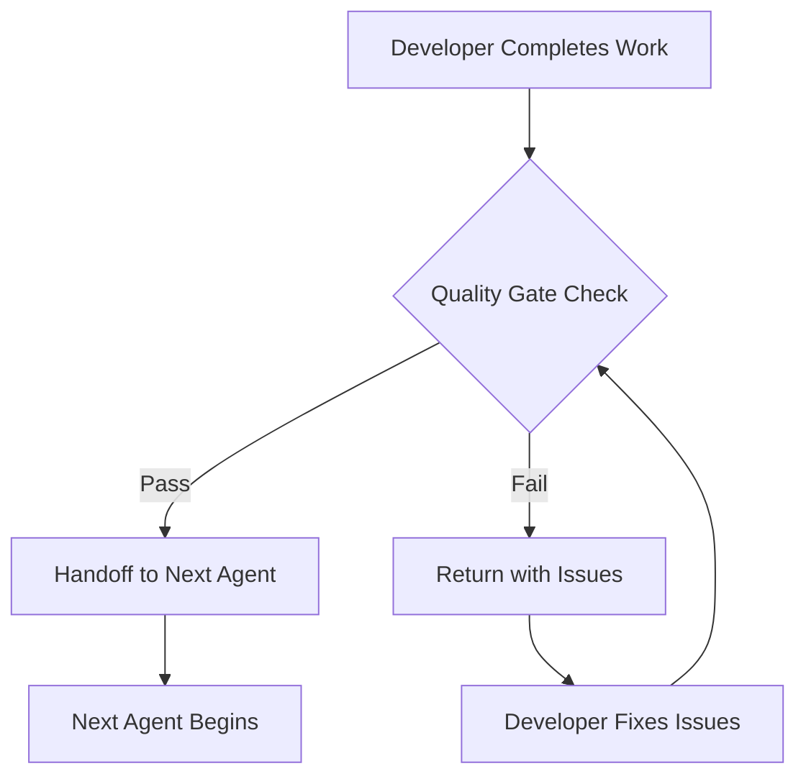

# Quality Gates User Guide
## Comprehensive Quality Enforcement for ERPNext Development

### Overview

The Quality Gates system ensures that all code developed using the BMAD Method for ERPNext meets strict quality standards before handoffs, submissions, or deployments. This system is **MANDATORY** and cannot be bypassed.

---

## 🎯 What Are Quality Gates?

Quality Gates are automated checkpoints that validate code quality, structure compliance, testing completeness, and documentation before allowing work to proceed. Think of them as security checkpoints at an airport - you cannot board without passing through them.

### Key Components

1. **quality-gates-definition.yaml** - Master configuration defining all gates
2. **quality-gate-enforcement-workflow.yaml** - Workflow that executes gates
3. **quality-gate-checklist.md** - Manual checklist for verification
4. **testing-execution-workflow.yaml** - Comprehensive testing procedures

---

## 🔄 How Quality Gates Work

### The Flow



### Automatic Enforcement Points

Quality Gates are automatically triggered at:
- **Before any handoff** between agents
- **Before code submission** (PR creation)
- **Before deployment** requests
- **When explicitly requested** by coordinator or user

---

## 📋 The Four Gate Stages

### 1. Pre-Development Gates
**When**: Before starting any development work
**Purpose**: Ensure proper understanding and planning

- ✅ Context Detection (What type of work?)
- ✅ Structure Requirements (Know the patterns)
- ✅ Dependency Analysis (Understand impacts)
- ✅ Test Strategy (Plan testing approach)

### 2. During-Development Gates
**When**: Continuously while developing
**Purpose**: Prevent issues from accumulating

- ✅ Import Validation (No forbidden patterns)
- ✅ Frappe Compliance (Only Frappe features)
- ✅ Incremental Testing (Test as you go)
- ✅ Structure Adherence (Files in right places)

### 3. Post-Development Gates
**When**: After completing development
**Purpose**: Comprehensive validation

- ✅ Full Test Suite (All tests passing)
- ✅ Structure Validation (Final check)
- ✅ Documentation Complete (Everything documented)
- ✅ Cross-Verification (Independent review)

### 4. Final Gates
**When**: Before release or major handoff
**Purpose**: Production readiness

- ✅ Eva Thorne Compliance (Framework standards)
- ✅ Integration Testing (Works with system)
- ✅ Performance Validation (Meets benchmarks)
- ✅ Security Review (No vulnerabilities)

---

## 👥 Who Does What?

### Development Coordinator (Claudia Donovan)
- **Enforces** quality gates at every handoff
- **Blocks** handoffs if gates fail
- **Routes** work back to originator with issues
- **Tracks** gate pass/fail metrics

### Testing Specialist (Steve Jinks)
- **Primary verifier** for all testing gates
- **Executes** comprehensive test suites
- **Validates** coverage requirements (≥80%)
- **Certifies** test results for handoffs

### Eva Thorne (Compliance Validator)
- **Validates** structure compliance
- **Checks** import patterns
- **Ensures** Frappe-first principles
- **Blocks** non-compliant code

### All Agents
- **Must complete** universal context detection first
- **Must pass** all applicable gates
- **Cannot proceed** without gate passage
- **Must document** any gate failures

---

## 🚫 What Gets Blocked?

### Structure Violations
```python
# ❌ BLOCKED: Wrong import pattern
from app_name.app_name.api import function  # Triple nesting

# ✅ CORRECT: Proper import
from app_name.api import function
```

### External Libraries
```python
# ❌ BLOCKED: External library
import requests  # Not allowed!

# ✅ CORRECT: Frappe method
frappe.make_get_request(url)
```

### Failing Tests
```bash
# ❌ BLOCKED: Tests not passing
FAIL: test_sales_order_validation
AssertionError: Validation not working

# ✅ REQUIRED: All tests green
Ran 47 tests in 12.3s
OK
```

### Missing Documentation
```python
# ❌ BLOCKED: No documentation
def complex_calculation(data):
    # Complex logic here
    return result

# ✅ REQUIRED: Documented code
def complex_calculation(data):
    """
    Calculate weighted average with seasonal adjustments.
    
    Args:
        data: Dictionary of sales data with dates
    
    Returns:
        Adjusted weighted average
    """
    # Complex logic here
    return result
```

---

## 🔧 How to Pass Quality Gates

### 1. Follow the Checklist
Use `quality-gate-checklist.md` as your guide:
- Complete each section
- Check off items as you go
- Don't skip any checks

### 2. Run Tests Early and Often
```bash
# Run tests frequently
bench --site [site] run-tests --app [app]

# Check coverage
bench --site [site] coverage --app [app]
```

### 3. Validate Structure
```bash
# Check for forbidden patterns
find . -path "*/frontend/*" -type f  # Should be empty
grep -r "from app_name.app_name.api" .  # Should be empty
```

### 4. Use Frappe Methods Only
Always use Frappe's built-in features:
- `frappe.get_doc()` not direct imports
- `frappe.enqueue()` not threading
- `frappe.cache()` not Redis directly
- `@frappe.whitelist()` on all APIs

---

## 📊 Gate Metrics and Scoring

### What's Tracked
- **Pass Rate**: Percentage of gates passed first attempt
- **Common Failures**: Most frequent gate failures
- **Time to Pass**: How long to clear gates
- **Developer Trends**: Individual improvement over time

### Quality Score Calculation
```
Quality Score = (Gates Passed / Total Gates) × 100
              × (1 - (Retry Attempts / 3))
              × Coverage Percentage
```

### Target Metrics
- First-attempt pass rate: **>70%**
- Code coverage: **≥80%**
- Zero critical failures
- Documentation: **100% complete**

---

## 🆘 When Gates Fail

### First Failure
1. **Specific issues** identified and documented
2. **Work returned** to originating agent
3. **Fix required** before retry
4. **Guidance provided** on resolution

### Second Failure
1. **Escalation** to development coordinator
2. **Peer review** required
3. **Root cause** analysis
4. **Mentoring** if needed

### Third Failure
1. **Work stopped** completely
2. **Team review** required
3. **Product owner** involvement
4. **Retraining** consideration

---

## 💡 Best Practices

### 1. Pre-Flight Checks
Before starting work:
- Read `ERPNEXT-APP-STRUCTURE-PATTERNS.md`
- Review `quality-gate-checklist.md`
- Understand gate requirements
- Plan your approach

### 2. Continuous Validation
While working:
- Test after each change
- Check imports regularly
- Validate structure often
- Document as you go

### 3. Self-Review
Before handoff:
- Run full test suite
- Check all documentation
- Validate structure
- Review against checklist

### 4. Learn from Failures
When gates fail:
- Understand why it failed
- Learn the correct pattern
- Update your approach
- Share learnings with team

---

## 🚀 Quick Commands

### Check Quality Gates Status
```bash
# View current gate status
/bmadErpNext:agent:development-coordinator
*check-quality-gates

# Force gate validation
*enforce-gates [agent-name]
```

### Run Quality Gate Workflow
```bash
# Execute full gate validation
*validate-handoff from-agent to-agent

# Review gate failures
*review-gate-failures
```

### Testing Commands
```bash
# Run all tests
bench --site [site] run-tests --app [app]

# Check specific module
bench --site [site] run-tests --app [app] --module [module]

# Coverage report
bench --site [site] coverage --app [app]
```

---

## 📝 Quality Gate Report

After each gate execution, a report is generated:

```yaml
Quality Gate Report
Date: 2024-01-15
Agent: api-developer
Context: NEW_DEVELOPMENT

Gates Executed:
  ✅ Structure Validation: PASSED
  ✅ Import Validation: PASSED
  ❌ Test Execution: FAILED (3 tests failing)
  ⏸️ Documentation: NOT EXECUTED

Issues Found:
  - test_api_permissions: Permission check missing
  - test_data_validation: Input validation error
  - test_error_handling: Exception not caught

Recommendations:
  1. Add @frappe.whitelist() to new endpoints
  2. Implement input validation
  3. Add try/catch blocks

Status: BLOCKED - Fix issues before handoff
```

---

## 🎓 Training Resources

### Essential Reading
1. `ERPNEXT-APP-STRUCTURE-PATTERNS.md` - Structure requirements
2. `MANDATORY-SAFETY-PROTOCOLS.md` - Safety requirements
3. `frappe-first-principles.md` - Framework patterns
4. `quality-gate-checklist.md` - Verification steps

### Workflows to Study
1. `universal-context-detection-workflow.yaml`
2. `quality-gate-enforcement-workflow.yaml`
3. `testing-execution-workflow.yaml`
4. `coordination-workflow.yaml`

---

## ❓ FAQ

### Q: Can I skip quality gates to save time?
**A**: No. Quality gates are mandatory and cannot be bypassed. They prevent larger issues later.

### Q: What if I disagree with a gate failure?
**A**: Escalate to the development coordinator with evidence. The product owner makes final decisions.

### Q: How can I improve my gate pass rate?
**A**: Follow the checklist, test continuously, use correct patterns, and learn from failures.

### Q: Are gates the same for all work types?
**A**: No. Gates adapt based on context (troubleshooting, new development, enhancement, migration).

### Q: What happens if gates keep failing?
**A**: After 3 attempts, work stops for team review and retraining.

---

## 📞 Getting Help

If you need help with quality gates:

1. **First**: Review this guide and checklist
2. **Second**: Ask the development coordinator
3. **Third**: Consult the testing specialist
4. **Fourth**: Escalate to product owner

---

## 🏁 Conclusion

Quality Gates ensure that every piece of code:
- ✅ Follows ERPNext structure patterns
- ✅ Uses only Frappe framework features
- ✅ Has comprehensive tests
- ✅ Is properly documented
- ✅ Integrates safely with existing code

**Remember**: Quality Gates are your friend. They catch issues early when they're easy to fix, rather than later when they're expensive to resolve.

---

*Quality Gates: Because excellent code is not optional, it's mandatory.*