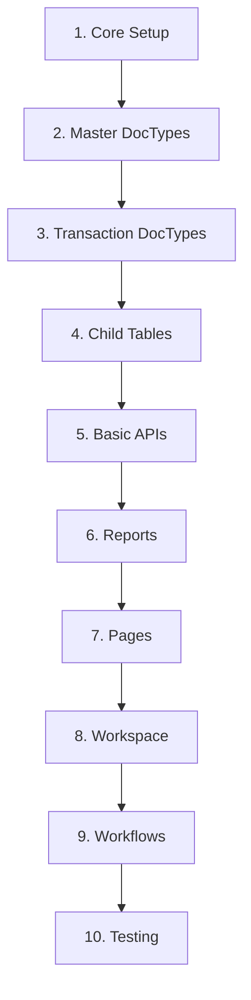

# Task: Plan Complete ERPNext App

## Purpose
Ensure a new or existing ERPNext app has all required components: DocTypes, Reports, Pages, APIs, Workspaces, and supporting files.

## Prerequisites
- Understanding of ERPNext app architecture
- List of business requirements
- Knowledge of module structure
- Familiarity with Frappe framework

## Input Requirements
```yaml
app_name: String          # Name of the app (snake_case)
app_title: String         # Display title
modules: Array           # List of modules to create
primary_doctype: String  # Main DocType for the app
business_domain: String  # Domain (Manufacturing, Retail, Services, etc.)
```

## Step-by-Step Planning Process

### Phase 1: Foundation Planning

#### 1.1 Define App Structure
```yaml
app_structure:
  core_files:
    - setup.py
    - pyproject.toml
    - requirements.txt
    - package.json (if frontend needed)
    - hooks.py
    - modules.txt
    - patches.txt
    - README.md
    - license.txt
    - .gitignore
  
  directories:
    - {{app_name}}/
      - __init__.py
      - hooks.py
      - modules.txt
      - patches.txt
      - api/
      - public/
      - templates/
      - www/
      - fixtures/
      - config/
```

#### 1.2 Define Modules
For each module, plan:
```yaml
module_structure:
  {{module_name}}/:
    - __init__.py
    - doctype/
    - page/
    - report/
    - workspace/
    - print_format/
    - dashboard_chart/
    - notification/
    - workflow/
```

### Phase 2: DocType Planning

#### 2.1 Identify Required DocTypes

**Master DocTypes** (Reference Data):
```yaml
masters:
  - name: {{app_name}} Item
    type: Master
    fields: [item_code, item_name, description, category, status]
    features: [naming_series, track_changes, image_field]
    
  - name: {{app_name}} Category
    type: Master
    is_tree: true
    fields: [category_name, parent_category, description]
    
  - name: {{app_name}} Settings
    type: Single
    fields: [enable_feature_x, default_value_y, configuration_z]
```

**Transactional DocTypes** (Business Transactions):
```yaml
transactions:
  - name: {{app_name}} Order
    type: Document
    is_submittable: true
    fields: [order_no, date, customer, items, total]
    child_tables: [{{app_name}} Order Item]
    features: [workflow, print_format, email_template]
    
  - name: {{app_name}} Payment
    type: Document
    is_submittable: true
    fields: [payment_no, date, amount, reference]
    features: [accounting_integration]
```

**Child DocTypes** (Table within parent):
```yaml
child_tables:
  - name: {{app_name}} Order Item
    parent: {{app_name}} Order
    fields: [item, quantity, rate, amount]
    
  - name: {{app_name}} Tax Detail
    parent: {{app_name}} Order
    fields: [tax_type, rate, amount]
```

#### 2.2 DocType Features Matrix

| DocType | Single | Tree | Submittable | Track Changes | Workflow | Quick Entry |
|---------|--------|------|-------------|---------------|----------|-------------|
| Settings | ✓ | ✗ | ✗ | ✓ | ✗ | ✗ |
| Category | ✗ | ✓ | ✗ | ✓ | ✗ | ✓ |
| Order | ✗ | ✗ | ✓ | ✓ | ✓ | ✗ |
| Item | ✗ | ✗ | ✗ | ✓ | ✗ | ✓ |

### Phase 3: Reports Planning

#### 3.1 Identify Required Reports

**Operational Reports**:
```yaml
operational_reports:
  - name: {{app_name}} Daily Summary
    type: Query Report
    purpose: Daily transaction overview
    filters: [date_range, status, category]
    columns: [date, transaction_no, amount, status]
    
  - name: {{app_name}} Register
    type: Query Report
    purpose: Complete transaction list
    filters: [from_date, to_date, customer, item]
    export: true
```

**Analytical Reports**:
```yaml
analytical_reports:
  - name: {{app_name}} Analytics
    type: Script Report
    purpose: Trends and insights
    charts: [line_chart, pie_chart]
    filters: [period, category, metric]
    
  - name: {{app_name}} Dashboard
    type: Script Report
    purpose: KPI overview
    widgets: [cards, gauges, charts]
```

#### 3.2 Report Features Required
- Filters with date ranges
- Export to Excel/CSV
- Chart visualizations
- Drill-down capabilities
- Role-based data filtering
- Print formats

### Phase 4: Pages Planning

#### 4.1 Identify Required Pages

```yaml
pages:
  - name: {{app_name}}_dashboard
    type: Dashboard
    components: [charts, cards, shortcuts]
    data_sources: [realtime, cached]
    
  - name: {{app_name}}_analytics
    type: Analytics
    vue_enabled: true
    components: [filters, charts, tables]
    
  - name: {{app_name}}_settings
    type: Configuration
    sections: [general, advanced, integrations]
```

#### 4.2 Page Components Planning

For Vue-based pages:
```javascript
page_structure:
  - public/js/{{page_name}}.bundle.js  # Entry point
  - public/js/{{page_name}}/
    - {{PageName}}.vue               # Main component
    - store.js                       # Pinia store
    - components/
      - FilterPanel.vue
      - DataGrid.vue
      - ChartWidget.vue
```

### Phase 5: API Endpoints Planning

#### 5.1 CRUD Operations
```python
crud_apis:
  - get_{{entity}}_list()      # GET /api/method/app.api.get_list
  - get_{{entity}}()           # GET /api/method/app.api.get
  - create_{{entity}}()        # POST /api/method/app.api.create
  - update_{{entity}}()        # PUT /api/method/app.api.update
  - delete_{{entity}}()        # DELETE /api/method/app.api.delete
```

#### 5.2 Business Logic APIs
```python
business_apis:
  - calculate_{{metric}}()     # Complex calculations
  - process_{{workflow}}()     # Workflow operations
  - generate_{{report}}()      # Report generation
  - validate_{{data}}()        # Data validation
  - integrate_{{system}}()     # External integration
```

### Phase 6: Workspace Planning

#### 6.1 Workspace Structure
```yaml
workspace:
  name: {{app_name}}
  icon: dashboard  # Use valid Frappe icon
  
  shortcuts:
    - New {{Entity}}
    - {{Entity}} List
    - Analytics Dashboard
    - Quick Report
  
  cards:
    - name: Transactions
      links: [Order, Payment, Invoice]
    
    - name: Masters
      links: [Item, Category, Customer]
    
    - name: Reports
      links: [Daily Summary, Analytics, Register]
    
    - name: Settings
      links: [App Settings, User Permissions]
```

### Phase 7: Supporting Components

#### 7.1 Workflows
```yaml
workflows:
  - name: {{app_name}} Approval
    states: [Draft, Pending, Approved, Rejected]
    transitions:
      - from: Draft
        to: Pending
        action: Submit for Approval
        role: User
      
      - from: Pending
        to: Approved
        action: Approve
        role: Manager
```

#### 7.2 Print Formats
```yaml
print_formats:
  - name: {{app_name}} Invoice
    doctype: {{app_name}} Order
    format: HTML/Jinja2
    
  - name: {{app_name}} Receipt
    doctype: {{app_name}} Payment
    format: HTML/Jinja2
```

#### 7.3 Email Templates
```yaml
email_templates:
  - name: Order Confirmation
    subject: "Order #{{ name }} Confirmed"
    
  - name: Payment Receipt
    subject: "Payment Received - {{ payment_no }}"
```

### Phase 8: Validation Checklist

#### 8.1 Component Validation Matrix

| Component Type | Count Planned | Count Implemented | Status |
|---------------|--------------|-------------------|---------|
| Parent DocTypes | ___ | ___ | ☐ |
| Child DocTypes | ___ | ___ | ☐ |
| Query Reports | ___ | ___ | ☐ |
| Script Reports | ___ | ___ | ☐ |
| Pages | ___ | ___ | ☐ |
| API Endpoints | ___ | ___ | ☐ |
| Workflows | ___ | ___ | ☐ |
| Print Formats | ___ | ___ | ☐ |

#### 8.2 Dependency Check
```yaml
dependencies:
  - All child DocTypes have parent DocTypes ✓
  - All workspace links point to valid components ✓
  - All reports have required DocTypes ✓
  - All pages have API endpoints ✓
  - All workflows have DocTypes ✓
```

### Phase 9: Implementation Sequence



### Phase 10: Testing Plan

#### 10.1 Component Tests
```python
test_components:
  doctypes:
    - Create/Read/Update/Delete operations
    - Field validations
    - Permission checks
    - Workflow transitions
  
  reports:
    - Data accuracy
    - Filter functionality
    - Export capabilities
    - Performance (< 2s load)
  
  pages:
    - Route accessibility
    - Component rendering
    - API integration
    - Mobile responsiveness
  
  apis:
    - Authentication
    - Input validation
    - Error handling
    - Response format
```

## Validation Script

```python
#!/usr/bin/env python3
"""
App Completeness Validator
Ensures all planned components exist
"""

def validate_app_completeness(app_name):
    missing = []
    
    # Check DocTypes
    for doctype in planned_doctypes:
        if not frappe.db.exists("DocType", doctype):
            missing.append(f"DocType: {doctype}")
    
    # Check Reports
    for report in planned_reports:
        if not frappe.db.exists("Report", report):
            missing.append(f"Report: {report}")
    
    # Check Pages
    for page in planned_pages:
        if not frappe.db.exists("Page", page):
            missing.append(f"Page: {page}")
    
    # Check Workspaces
    for workspace in planned_workspaces:
        if not frappe.db.exists("Workspace", workspace):
            missing.append(f"Workspace: {workspace}")
    
    if missing:
        print("❌ Missing Components:")
        for item in missing:
            print(f"  - {item}")
    else:
        print("✅ All planned components exist!")
    
    return len(missing) == 0
```

## Success Criteria

### Completeness Score
Calculate: (Implemented Components / Planned Components) × 100

- **90-100%**: Excellent - Ready for production
- **70-89%**: Good - Minor features missing
- **50-69%**: Fair - Significant work needed
- **< 50%**: Poor - Major development required

### Quality Metrics
- All DocTypes have controllers and tests
- All Reports load in < 2 seconds
- All Pages are mobile responsive
- All APIs have error handling
- Workspace has valid icons and links
- Documentation is complete

## Common Pitfalls to Avoid

1. **Creating child tables as workspace links** - Only parent DocTypes
2. **Using FontAwesome icons** - Use Frappe's valid icons
3. **Missing API whitelisting** - All endpoints need @frappe.whitelist()
4. **Forgetting permissions** - Every component needs role permissions
5. **No error handling** - All APIs need try/catch blocks
6. **Missing tests** - Critical features need test coverage
7. **No documentation** - Users need guides and API docs

## Next Steps

1. Use audit checklist to verify implementation
2. Run validation scripts regularly
3. Monitor missing components
4. Plan sprints to complete gaps
5. Test thoroughly before deployment
6. Document for users and developers

## Output

A complete app should have:
- ✅ All planned DocTypes implemented
- ✅ All reports functional and optimized
- ✅ All pages accessible and responsive
- ✅ All APIs secured and documented
- ✅ Workspace with valid navigation
- ✅ Complete test coverage
- ✅ User documentation
- ✅ No missing dependencies