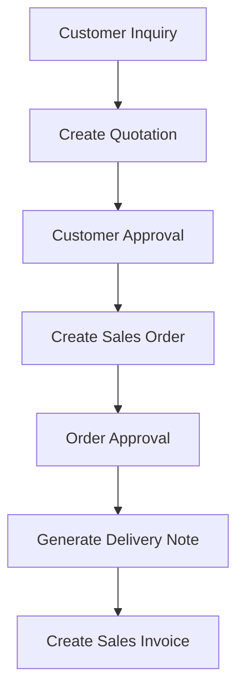

# Shard ERPNext Documentation

## Purpose
Establish strategies and processes for effectively organizing, structuring, and managing large-scale ERPNext project documentation, ensuring scalability, maintainability, and easy navigation across complex implementations.

## Prerequisites
- Large-scale ERPNext project with extensive documentation needs
- Understanding of documentation architecture principles
- Team collaboration tools and processes established
- Version control system in place

## Input Requirements
```yaml
project_scale:
  team_size: Integer # Number of team members
  modules_count: Integer # Number of ERPNext modules being implemented
  custom_apps: Integer # Number of custom applications
  integration_points: Integer # Number of external integrations
  documentation_volume: String # Estimated total documentation size
  maintenance_duration: String # Expected project lifecycle
```

## Step-by-Step Process

### Step 1: Documentation Assessment and Planning

#### Analyze Documentation Scope
```yaml
documentation_inventory:
  business_documents:
    - requirements_specifications: "~200 pages"
    - process_documentation: "~150 pages"
    - user_stories: "~300 individual stories"
    - business_rules: "~100 rules"
    
  technical_documents:
    - system_architecture: "~50 pages"
    - api_documentation: "~400 endpoints"
    - database_design: "~200 tables/doctypes"
    - integration_specs: "~15 external systems"
    
  operational_documents:
    - user_manuals: "~500 pages"
    - admin_guides: "~200 pages"
    - troubleshooting: "~100 procedures"
    - training_materials: "~50 hours of content"
    
  project_management:
    - project_plans: "~30 documents"
    - meeting_minutes: "~100 sessions"
    - decision_logs: "~200 decisions"
    - change_requests: "~50 changes"
```

#### Define Sharding Strategy
```yaml
sharding_dimensions:
  by_audience:
    - end_users: "User-facing documentation"
    - administrators: "System administration guides"
    - developers: "Technical implementation docs"
    - business_stakeholders: "Business process documentation"
    
  by_module:
    - sales: "Sales module documentation"
    - purchasing: "Procurement module documentation"
    - manufacturing: "Production module documentation"
    - accounting: "Financial module documentation"
    
  by_layer:
    - business_layer: "Business processes and requirements"
    - application_layer: "ERPNext configuration and customization"
    - data_layer: "Database design and data management"
    - integration_layer: "External system integrations"
    
  by_lifecycle:
    - planning: "Pre-implementation documentation"
    - implementation: "Development and configuration docs"
    - deployment: "Go-live and production documentation"
    - operations: "Ongoing maintenance and support docs"
```

### Step 2: Documentation Architecture Design

#### Multi-Repository Structure
```
erpnext-project-docs/
├── 00-project-overview/          # Central project information
│   ├── README.md
│   ├── project-charter.md
│   ├── stakeholder-matrix.md
│   └── documentation-map.md
├── 01-business-docs/             # Business-focused repository
│   ├── requirements/
│   ├── processes/
│   ├── user-stories/
│   └── business-rules/
├── 02-technical-docs/            # Technical documentation
│   ├── architecture/
│   ├── apis/
│   ├── database/
│   └── integrations/
├── 03-module-docs/               # Module-specific documentation
│   ├── sales/
│   ├── purchasing/
│   ├── manufacturing/
│   └── accounting/
├── 04-user-docs/                 # End-user documentation
│   ├── user-manuals/
│   ├── training-materials/
│   ├── quick-reference/
│   └── faqs/
├── 05-admin-docs/                # Administrative documentation
│   ├── system-admin/
│   ├── security/
│   ├── backup-recovery/
│   └── monitoring/
└── 06-project-management/        # Project management docs
    ├── plans/
    ├── meetings/
    ├── decisions/
    └── changes/
```

#### Repository Organization Strategy
```yaml
repository_structure:
  main_repository:
    name: "erpnext-project-docs"
    purpose: "Central documentation hub and navigation"
    contains:
      - "Project overview and navigation"
      - "Cross-repository documentation map"
      - "Documentation standards and templates"
      - "Search indices and cross-references"
      
  specialized_repositories:
    business_docs:
      audience: "Business analysts, stakeholders"
      access_level: "Internal team + stakeholders"
      update_frequency: "Weekly during requirements phase"
      
    technical_docs:
      audience: "Developers, architects, technical leads"
      access_level: "Technical team only"
      update_frequency: "Daily during development"
      
    user_docs:
      audience: "End users, trainers"
      access_level: "Public within organization"
      update_frequency: "Bi-weekly during testing"
      
    admin_docs:
      audience: "System administrators, support team"
      access_level: "Admin team only"
      update_frequency: "As needed"
```

### Step 3: Content Organization Framework

#### Hierarchical Content Structure
```yaml
content_hierarchy:
  level_1_overview:
    purpose: "High-level orientation"
    content_type: "Executive summaries, navigation guides"
    target_length: "1-2 pages per topic"
    example: "Sales Module Overview"
    
  level_2_functional:
    purpose: "Functional area deep-dive"
    content_type: "Process flows, feature descriptions"
    target_length: "5-10 pages per function"
    example: "Quote-to-Order Process"
    
  level_3_procedural:
    purpose: "Step-by-step procedures"
    content_type: "How-to guides, configuration steps"
    target_length: "2-5 pages per procedure"
    example: "Configure Sales Order Workflow"
    
  level_4_reference:
    purpose: "Detailed reference information"
    content_type: "Field definitions, API specs, troubleshooting"
    target_length: "Variable length"
    example: "Sales Order DocType Field Reference"
```

#### Content Tagging System
```yaml
tagging_taxonomy:
  by_module:
    tags: ["sales", "purchasing", "manufacturing", "accounting", "hr", "crm"]
    purpose: "Module-based content filtering"
    
  by_audience:
    tags: ["end-user", "admin", "developer", "business-analyst", "trainer"]
    purpose: "Role-based content personalization"
    
  by_complexity:
    tags: ["beginner", "intermediate", "advanced", "expert"]
    purpose: "Progressive learning paths"
    
  by_content_type:
    tags: ["overview", "tutorial", "reference", "troubleshooting", "api", "configuration"]
    purpose: "Content format categorization"
    
  by_implementation_phase:
    tags: ["planning", "development", "testing", "deployment", "maintenance"]
    purpose: "Project lifecycle organization"
```

### Step 4: Cross-Reference and Linking Strategy

#### Documentation Interconnection
```yaml
linking_strategy:
  centralized_index:
    location: "00-project-overview/documentation-map.md"
    structure:
      - module_index: "Links to all module documentation"
      - process_index: "End-to-end business process documentation"
      - technical_index: "Technical documentation by component"
      - user_journey_index: "User role-based documentation paths"
      
  bidirectional_references:
    business_to_technical:
      - "Business requirement → Technical implementation"
      - "Process step → Configuration procedure"
      - "Business rule → System constraint"
      
    technical_to_business:
      - "API endpoint → Business use case"
      - "Database table → Business entity"
      - "Configuration → Process impact"
      
  contextual_navigation:
    previous_next_links: "Sequential process documentation"
    related_topics: "Similar or dependent topics"
    see_also_sections: "Cross-functional references"
    breadcrumb_navigation: "Hierarchical location awareness"
```

#### Link Management System
```markdown
<!-- Link Reference Template -->
## Cross-References

### Related Business Processes
- [Customer Onboarding Process](../business-docs/processes/customer-onboarding.md)
- [Order Fulfillment Workflow](../business-docs/processes/order-fulfillment.md)

### Technical Implementation
- [Customer DocType Configuration](../technical-docs/doctypes/customer.md)
- [Sales Order API Reference](../technical-docs/apis/sales-order.md)

### User Documentation
- [Customer Management User Guide](../user-docs/sales/customer-management.md)
- [Order Processing Quick Reference](../user-docs/sales/order-processing-quick-ref.md)

### Administrative Procedures
- [Customer Data Backup](../admin-docs/backup-recovery/customer-data.md)
- [Sales Reporting Configuration](../admin-docs/reporting/sales-reports.md)
```

### Step 5: Documentation Templates and Standards

#### Modular Documentation Templates
```markdown
---
title: "Sales Order Management Process"
module: "Sales"
audience: ["business-analyst", "end-user"]
complexity: "intermediate"
phase: ["implementation", "operations"]
version: "2.1"
last_updated: "2024-02-15"
author: "Business Analyst"
reviewers: ["Sales Manager", "Technical Lead"]
related_docs:
  - business: ["customer-onboarding.md", "pricing-management.md"]
  - technical: ["sales-order-doctype.md", "sales-workflow.md"]
  - user: ["sales-user-guide.md"]
---

# Sales Order Management Process

## Process Overview
[High-level description of the process]

## Stakeholders
| Role | Responsibility | ERPNext Access |
|------|---------------|----------------|
| Sales Executive | Order creation and customer communication | Sales User |
| Sales Manager | Order approval and oversight | Sales Manager |
| Warehouse Staff | Order fulfillment | Stock User |

## Process Flow


## ERPNext Implementation

### DocTypes Involved
- **Customer**: Customer master data
- **Quotation**: Price quotations to customers
- **Sales Order**: Confirmed customer orders
- **Delivery Note**: Goods delivery documentation
- **Sales Invoice**: Customer billing

### Workflow Configuration
[Detailed workflow steps and approvals]

### Custom Fields Required
[List of custom fields needed]

### Reports and Dashboards
[Required reporting functionality]

## Business Rules
1. Orders above $10,000 require manager approval
2. Customer credit limit must be checked before order confirmation
3. Delivery date must be realistic based on stock availability

## Integration Points
- **E-commerce Platform**: Automatic order import
- **Accounting System**: Invoice and payment sync
- **Shipping Carrier**: Tracking number updates

## Success Metrics
- Order processing time: < 4 hours
- Order accuracy: > 99%
- Customer satisfaction: > 4.5/5

## Related Documentation
[Cross-references to related documents]
```

#### Specialized Templates by Content Type
```yaml
template_library:
  api_documentation:
    structure:
      - endpoint_description
      - request_parameters
      - response_format
      - error_codes
      - example_requests
      - rate_limits
      - authentication_requirements
      
  configuration_guide:
    structure:
      - prerequisites
      - step_by_step_instructions
      - screenshots_or_diagrams
      - validation_steps
      - troubleshooting_common_issues
      - related_configurations
      
  user_manual:
    structure:
      - feature_overview
      - getting_started
      - common_tasks
      - advanced_features
      - tips_and_best_practices
      - frequently_asked_questions
      
  troubleshooting_guide:
    structure:
      - problem_description
      - symptoms_checklist
      - root_cause_analysis
      - solution_steps
      - prevention_measures
      - escalation_procedures
```

### Step 6: Content Management Workflow

#### Documentation Lifecycle Management
```yaml
content_lifecycle:
  creation_phase:
    trigger: "New feature or process identified"
    responsible: "Subject matter expert"
    deliverable: "Initial draft document"
    review_required: "Technical and business review"
    
  maintenance_phase:
    trigger: "System changes or process updates"
    frequency: "Quarterly review cycle"
    responsible: "Document owner"
    validation: "Accuracy verification"
    
  retirement_phase:
    trigger: "Feature deprecation or process change"
    process: "Archive with redirect links"
    retention: "Historical reference maintained"
    notification: "Stakeholders informed"
```

#### Collaborative Authoring Process
```yaml
authoring_workflow:
  roles_and_responsibilities:
    content_owner:
      - "Overall document accountability"
      - "Content accuracy and currency"
      - "Stakeholder coordination"
      
    subject_matter_expert:
      - "Technical accuracy review"
      - "Business process validation"
      - "Implementation guidance"
      
    editor:
      - "Language and style consistency"
      - "Template compliance"
      - "Cross-reference verification"
      
    reviewer:
      - "Content approval"
      - "Quality assurance"
      - "Stakeholder sign-off"
      
  review_cycles:
    draft_review:
      participants: ["SME", "Content Owner"]
      criteria: "Technical accuracy, completeness"
      timeline: "3 business days"
      
    editorial_review:
      participants: ["Editor", "Content Owner"]
      criteria: "Style, clarity, template compliance"
      timeline: "2 business days"
      
    stakeholder_review:
      participants: ["Business Stakeholders", "End Users"]
      criteria: "Business relevance, usability"
      timeline: "5 business days"
      
    final_approval:
      participants: ["Document Approver"]
      criteria: "Overall quality and completeness"
      timeline: "1 business day"
```

### Step 7: Search and Discovery Framework

#### Searchable Content Architecture
```yaml
search_implementation:
  full_text_search:
    scope: "All documentation repositories"
    indexing: "Automated on content update"
    features:
      - "Boolean search operators"
      - "Phrase searching"
      - "Wildcard support"
      - "Relevance ranking"
      
  faceted_search:
    dimensions:
      - module: "Filter by ERPNext module"
      - audience: "Filter by target audience"
      - content_type: "Filter by document type"
      - complexity: "Filter by difficulty level"
      
  contextual_search:
    features:
      - "Search within current module"
      - "Search within current process"
      - "Related content suggestions"
      - "Recently viewed documents"
```

#### Content Discovery Tools
```yaml
discovery_mechanisms:
  guided_navigation:
    learning_paths:
      - "New user onboarding"
      - "Administrator setup"
      - "Developer integration"
      - "Business analyst requirements"
      
    decision_trees:
      - "Which module do I need?"
      - "How do I configure X?"
      - "What's the best practice for Y?"
      
  automated_recommendations:
    based_on_role: "Role-specific content suggestions"
    based_on_activity: "Recently accessed related documents"
    based_on_popularity: "Most frequently accessed content"
    based_on_updates: "Recently updated relevant content"
    
  visual_navigation:
    process_maps: "Visual process flow with linked documentation"
    system_diagrams: "Interactive system architecture with doc links"
    org_charts: "Role-based documentation access"
    module_maps: "ERPNext module interconnection with docs"
```

### Step 8: Version Control and Change Management

#### Documentation Versioning Strategy
```yaml
versioning_approach:
  semantic_versioning:
    major_version: "Significant content restructure"
    minor_version: "New sections or substantial updates"
    patch_version: "Corrections and small improvements"
    
  release_coordination:
    with_software_releases: "Documentation versions aligned with ERPNext releases"
    independent_updates: "Content updates between software releases"
    hotfix_documentation: "Urgent documentation corrections"
    
  historical_preservation:
    version_archives: "Previous versions maintained for reference"
    migration_guides: "Documentation for version transitions"
    deprecated_notices: "Clear indication of outdated content"
```

#### Change Impact Assessment
```yaml
change_management:
  impact_analysis:
    content_dependencies: "Identify affected related documents"
    cross_references: "Update all linking documents"
    user_impact: "Assess effect on different user groups"
    training_implications: "Determine retraining requirements"
    
  change_notification:
    stakeholder_alerts: "Notify relevant stakeholders of changes"
    version_highlights: "Summary of significant changes"
    migration_instructions: "Guide for adopting new procedures"
    
  rollback_procedures:
    content_backup: "Previous version readily available"
    quick_revert: "Rapid rollback for critical errors"
    partial_rollback: "Section-specific version restoration"
```

### Step 9: Quality Assurance and Metrics

#### Content Quality Framework
```yaml
quality_metrics:
  accuracy_measures:
    technical_review_score: "Expert assessment of technical accuracy"
    user_feedback_rating: "End-user evaluation of usefulness"
    error_report_frequency: "Rate of reported inaccuracies"
    
  usability_measures:
    task_completion_rate: "User success rate following documentation"
    time_to_find_information: "Average search and discovery time"
    user_satisfaction_score: "Post-use satisfaction survey"
    
  maintenance_measures:
    content_freshness: "Time since last update"
    broken_link_frequency: "Rate of invalid cross-references"
    template_compliance: "Adherence to documentation standards"
```

#### Continuous Improvement Process
```yaml
improvement_cycle:
  quarterly_reviews:
    content_audit: "Systematic review of documentation accuracy"
    usage_analytics: "Analysis of documentation access patterns"
    stakeholder_feedback: "Structured feedback collection"
    process_optimization: "Documentation process improvements"
    
  annual_assessments:
    architecture_review: "Evaluation of documentation structure"
    tool_effectiveness: "Assessment of documentation tools"
    training_needs: "Documentation skills gap analysis"
    strategic_alignment: "Alignment with business objectives"
```

### Step 10: Automation and Tooling

#### Automated Documentation Processes
```yaml
automation_framework:
  content_generation:
    api_documentation: "Auto-generate from code annotations"
    database_schema: "Auto-generate from ERPNext doctypes"
    change_logs: "Auto-generate from version control"
    
  quality_assurance:
    link_checking: "Automated broken link detection"
    spell_checking: "Automated spelling and grammar checks"
    template_validation: "Automated template compliance checking"
    
  publication_workflows:
    automated_builds: "Trigger documentation builds on updates"
    staging_deployment: "Automated staging environment updates"
    production_deployment: "Controlled production releases"
```

#### Integration with Development Tools
```yaml
tool_integrations:
  version_control:
    git_hooks: "Automated checks on documentation commits"
    branch_protection: "Require reviews for documentation changes"
    automated_merging: "Safe automated merging of approved changes"
    
  project_management:
    requirement_tracing: "Link requirements to documentation"
    task_completion: "Update documentation status with task completion"
    milestone_tracking: "Documentation deliverables in project milestones"
    
  communication_tools:
    slack_notifications: "Automated notifications of documentation updates"
    email_digests: "Regular summaries of documentation activity"
    review_reminders: "Automated reminders for pending reviews"
```

## Best Practices

### Scalable Documentation Architecture
- **Modular design**: Create self-contained documentation modules
- **Consistent structure**: Use standardized templates and organization
- **Clear ownership**: Assign specific ownership for each documentation area
- **Regular maintenance**: Establish routine review and update cycles

### Effective Content Management
- **Single source of truth**: Avoid content duplication across repositories
- **Progressive disclosure**: Layer information from general to specific
- **Context-aware linking**: Provide relevant cross-references
- **User-centric organization**: Structure content around user needs

### Collaboration and Workflow
- **Distributed authoring**: Enable multiple contributors while maintaining quality
- **Efficient review processes**: Streamline review cycles without sacrificing quality
- **Change management**: Control and track documentation changes
- **Feedback integration**: Incorporate user feedback into improvement cycles

---

*Effective documentation sharding enables large-scale ERPNext projects to maintain organized, accessible, and maintainable documentation throughout the project lifecycle.*