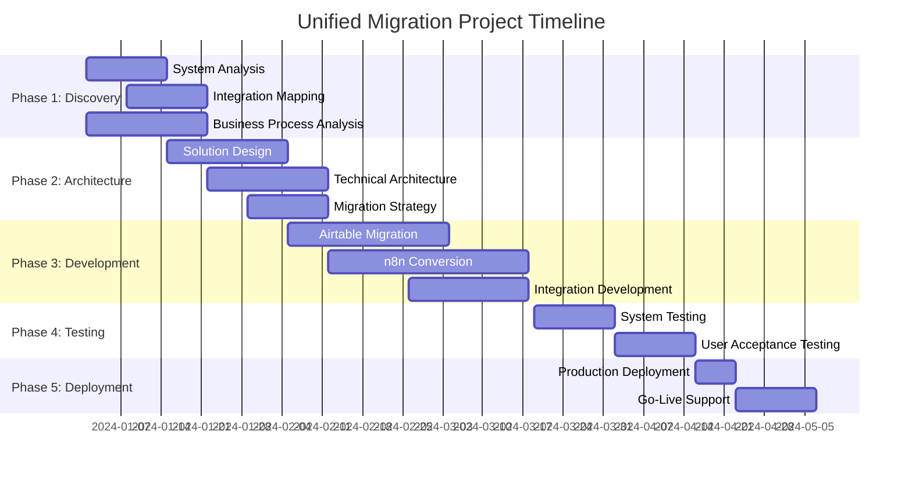

# Unified Airtable + n8n to ERPNext Migration Project
## Comprehensive Implementation Roadmap and Timeline

**Project Version:** 1.0.0  
**Document Type:** Master Implementation Roadmap  
**Created By:** BMAD Integration Tools - Workflow Specialist Agent  
**Target Duration:** 18-24 weeks  
**Complexity Level:** High  

---

## 1. EXECUTIVE SUMMARY

### 1.1 Project Overview
The unified Airtable + n8n to ERPNext migration project represents a comprehensive digital transformation initiative that consolidates two separate systems into a single, integrated ERPNext solution. This approach leverages synergies between systems, reduces overall project timeline by 20-30% compared to separate migrations, and ensures seamless preservation of integration points.

### 1.2 Strategic Benefits
- **Unified Data Model**: Eliminates synchronization issues between systems
- **Consolidated Automation**: Single point of control for all business processes
- **Reduced Complexity**: One migration project instead of two separate initiatives
- **Cost Optimization**: Lower licensing, training, and maintenance costs
- **Enhanced Visibility**: Complete business process transparency

### 1.3 Key Success Metrics
- **Functional Preservation**: 100% of critical business functionality maintained
- **Performance Enhancement**: Equal or better system performance
- **User Adoption**: >95% user acceptance within 30 days post go-live
- **Data Integrity**: Zero critical data loss during migration
- **Timeline Adherence**: Project completion within planned timeframe

---

## 2. MASTER PROJECT TIMELINE

### 2.1 Project Phases Overview

| Phase | Duration | Start Week | End Week | Critical Dependencies |
|-------|----------|------------|----------|----------------------|
| **Phase 1: Discovery & Analysis** | 4 weeks | Week 1 | Week 4 | Access to all systems |
| **Phase 2: Architecture & Design** | 5 weeks | Week 3 | Week 7 | Analysis completion |
| **Phase 3: Development & Migration** | 9 weeks | Week 6 | Week 14 | Architecture approval |
| **Phase 4: Testing & Validation** | 4 weeks | Week 13 | Week 16 | Development completion |
| **Phase 5: Deployment & Go-Live** | 3 weeks | Week 17 | Week 19 | Testing sign-off |
| **Phase 6: Stabilization & Optimization** | 5 weeks | Week 19 | Week 24 | Production deployment |

### 2.2 Parallel Work Streams Strategy

---

## 3. DETAILED WORK BREAKDOWN STRUCTURE

### 3.1 Phase 1: Discovery & Analysis (Weeks 1-4)

#### 3.1.1 Comprehensive System Analysis (Week 1-2)
**Duration:** 2 weeks  
**Team:** airtable-analyzer, n8n-workflow-analyst, business-analyst  
**Effort:** 120 hours  

**Key Deliverables:**
- Airtable base structure documentation (40 hours)
- n8n workflow inventory and analysis (45 hours)
- System integration dependency mapping (35 hours)

**Tasks:**
1. **Airtable Analysis** (40 hours)
   - Document all base structures and relationships
   - Analyze field types and validation rules
   - Map views and filtering logic
   - Document formulas and computed fields
   - Assess data quality and completeness

2. **n8n Workflow Analysis** (45 hours)
   - Export and catalog all active workflows
   - Document workflow triggers and conditions
   - Map external system integrations
   - Analyze error handling and retry logic
   - Document workflow performance metrics

3. **Integration Dependency Mapping** (35 hours)
   - Identify Airtable-to-n8n trigger points
   - Document data flow patterns
   - Map external API dependencies
   - Analyze timing and sequence requirements

#### 3.1.2 Business Process Integration Analysis (Week 2-3)
**Duration:** 2 weeks  
**Team:** business-analyst, workflow-specialist  
**Effort:** 80 hours  

**Key Deliverables:**
- End-to-end process documentation (50 hours)
- User role and permission mapping (30 hours)

**Critical Success Criteria:**
- All business processes documented with 100% accuracy
- Integration points identified and validated
- User requirements captured and prioritized

### 3.2 Phase 2: Architecture & Design (Weeks 3-7)

#### 3.2.1 Unified Solution Architecture (Week 3-5)
**Duration:** 3 weeks  
**Team:** erpnext-architect, api-architect, workflow-specialist  
**Effort:** 180 hours  

**Key Deliverables:**
- Master architecture document (60 hours)
- DocType design specifications (70 hours)
- API and integration architecture (50 hours)

**Tasks:**
1. **ERPNext Solution Design** (70 hours)
   - Design unified DocType structure
   - Plan custom field requirements
   - Design workflow and approval processes
   - Plan user interface modifications

2. **Data Model Unification** (60 hours)
   - Consolidate Airtable and n8n data models
   - Design relationship preservation strategy
   - Plan data transformation requirements
   - Design validation and integrity checks

3. **Integration Architecture** (50 hours)
   - Design external API integration points
   - Plan authentication and security framework
   - Design monitoring and logging architecture
   - Plan backup and recovery procedures

#### 3.2.2 Migration Strategy & Technical Planning (Week 5-7)
**Duration:** 2 weeks  
**Team:** data-integration-expert, workflow-converter  
**Effort:** 100 hours  

**Key Deliverables:**
- Detailed migration plan (40 hours)
- Risk assessment and mitigation strategy (30 hours)
- Testing strategy and acceptance criteria (30 hours)

### 3.3 Phase 3: Development & Migration (Weeks 6-14)

#### 3.3.1 Airtable Data Migration (Week 6-9)
**Duration:** 4 weeks  
**Team:** data-integration-expert, airtable-analyzer  
**Effort:** 200 hours  

**Key Deliverables:**
- ERPNext DocType implementations (80 hours)
- Data extraction and transformation scripts (70 hours)
- Data validation and quality assurance (50 hours)

**Parallel Activities:**
- Week 6-7: DocType development and testing
- Week 7-8: Data extraction script development
- Week 8-9: Data transformation and validation
- Week 9: Load testing and performance optimization

#### 3.3.2 n8n Workflow Conversion (Week 7-11)
**Duration:** 5 weeks  
**Team:** workflow-converter, n8n-workflow-analyst, api-developer  
**Effort:** 250 hours  

**Key Deliverables:**
- ERPNext workflow implementations (100 hours)
- Custom automation scripts (90 hours)
- External API integration endpoints (60 hours)

**Conversion Strategy:**
- Week 7-8: Critical workflow conversion (high priority)
- Week 9-10: Standard workflow conversion (medium priority)
- Week 10-11: Advanced workflow conversion and optimization

#### 3.3.3 Unified Integration Development (Week 12-14)
**Duration:** 3 weeks  
**Team:** api-developer, workflow-specialist  
**Effort:** 150 hours  

**Key Deliverables:**
- Unified automation framework (70 hours)
- Integration testing and validation (50 hours)
- Performance optimization (30 hours)

### 3.4 Phase 4: Testing & Validation (Weeks 13-16)

#### 3.4.1 System Integration Testing (Week 13-14)
**Duration:** 2 weeks  
**Team:** testing-specialist, erpnext-architect  
**Effort:** 120 hours  

**Testing Scope:**
- Functional testing of all converted features (60 hours)
- Integration testing with external systems (40 hours)
- Performance and load testing (20 hours)

#### 3.4.2 User Acceptance Testing (Week 15-16)
**Duration:** 2 weeks  
**Team:** business-analyst, end users, testing-specialist  
**Effort:** 100 hours  

**UAT Activities:**
- Business process validation (50 hours)
- User interface and experience testing (30 hours)
- Training and documentation validation (20 hours)

### 3.5 Phase 5: Deployment & Go-Live (Weeks 17-19)

#### 3.5.1 Production Deployment (Week 17)
**Duration:** 1 week  
**Team:** bench-operator, erpnext-architect  
**Effort:** 60 hours  

**Deployment Activities:**
- Production environment preparation (20 hours)
- Final data migration and validation (25 hours)
- System cutover and go-live support (15 hours)

#### 3.5.2 Go-Live Support (Week 18-19)
**Duration:** 2 weeks  
**Team:** Full project team (on-call support)  
**Effort:** 80 hours  

**Support Activities:**
- 24/7 system monitoring and support (40 hours)
- User training and assistance (25 hours)
- Issue resolution and system optimization (15 hours)

### 3.6 Phase 6: Stabilization & Optimization (Weeks 19-24)

#### 3.6.1 System Stabilization (Week 19-21)
**Duration:** 3 weeks  
**Team:** erpnext-architect, business-analyst  
**Effort:** 90 hours  

**Stabilization Activities:**
- Performance monitoring and optimization (40 hours)
- User feedback collection and issue resolution (30 hours)
- System fine-tuning and enhancement (20 hours)

#### 3.6.2 Knowledge Transfer & Documentation (Week 22-24)
**Duration:** 3 weeks  
**Team:** workflow-specialist, prd-generator  
**Effort:** 60 hours  

**Deliverables:**
- Comprehensive system documentation (30 hours)
- User training materials and guides (20 hours)
- Maintenance and support procedures (10 hours)

---

## 4. RESOURCE ALLOCATION AND TEAM STRUCTURE

### 4.1 Core Project Team

#### 4.1.1 Leadership Team
- **Project Manager**: Overall project coordination and stakeholder management
- **Technical Lead (erpnext-architect)**: Technical strategy and architecture oversight
- **Business Lead (business-analyst)**: Business requirements and process validation

#### 4.1.2 Specialized Agent Teams

**Migration Specialists Team** (4 agents)
- airtable-analyzer: Airtable system expertise
- n8n-workflow-analyst: n8n workflow expertise  
- data-integration-expert: Data migration and transformation
- workflow-converter: Workflow conversion and automation

**Development Team** (3 agents)
- api-developer: API and integration development
- frappe-ui-developer: User interface development
- bench-operator: Deployment and infrastructure

**Quality Assurance Team** (2 agents)
- testing-specialist: Comprehensive testing and validation
- structure-compliance-agent: Code quality and compliance

**Project Support Team** (2 agents)
- workflow-specialist: Process optimization and coordination
- prd-generator: Documentation and requirements management

### 4.2 Resource Calendar

| Phase | Week Range | Full-Time Resources | Part-Time Resources | Total Effort (Hours) |
|-------|------------|-------------------|-------------------|-------------------|
| Phase 1 | 1-4 | 3 | 2 | 280 |
| Phase 2 | 3-7 | 4 | 2 | 360 |
| Phase 3 | 6-14 | 6 | 3 | 720 |
| Phase 4 | 13-16 | 4 | 4 | 320 |
| Phase 5 | 17-19 | 5 | 6 | 280 |
| Phase 6 | 19-24 | 2 | 2 | 180 |

**Total Project Effort:** 2,140 hours

### 4.3 Skills and Capacity Matrix

| Agent Role | Core Skills | Availability | Utilization |
|------------|-------------|--------------|-------------|
| erpnext-architect | ERPNext, Architecture, System Design | 100% | Weeks 1-24 |
| airtable-analyzer | Airtable, Data Analysis, Migration | 80% | Weeks 1-10 |
| n8n-workflow-analyst | n8n, Workflow Analysis, Integration | 80% | Weeks 1-12 |
| workflow-converter | Automation, Python, ERPNext Development | 100% | Weeks 6-16 |
| data-integration-expert | ETL, Data Migration, Quality Assurance | 100% | Weeks 3-14 |
| api-developer | API Development, Integration, Python | 90% | Weeks 7-19 |
| testing-specialist | Testing, QA, Validation | 70% | Weeks 11-20 |
| business-analyst | Business Processes, Requirements | 60% | Weeks 1-24 |

---

## 5. CRITICAL PATH ANALYSIS

### 5.1 Critical Path Dependencies

**Primary Critical Path** (20 weeks):
1. System Analysis → Architecture Design → Development → Testing → Deployment

**Key Dependencies:**
- Airtable data model analysis must complete before DocType design
- n8n workflow analysis must complete before automation conversion
- Data migration must complete before workflow conversion testing
- All testing must pass before production deployment authorization

### 5.2 Risk-Critical Dependencies

**High-Risk Dependencies:**
1. **External System Access**: Delays in accessing Airtable/n8n systems
2. **Stakeholder Approval**: Architecture and design approval cycles
3. **Data Quality Issues**: Unexpected data quality problems requiring cleanup
4. **Integration Complexity**: Complex integration requirements extending development

### 5.3 Optimization Opportunities

**Parallel Work Streams:**
- Airtable analysis can run parallel with n8n analysis
- DocType development can start before complete analysis finish
- Training material development can run parallel with testing
- Documentation can be prepared during development phases

---

## 6. RISK MANAGEMENT TIMELINE

### 6.1 Risk Identification and Assessment

#### 6.1.1 Technical Risks

**RISK-001: Data Migration Complexity**
- **Probability:** Medium (3/5)
- **Impact:** High (4/5)
- **Risk Score:** 12 (High Risk)
- **Mitigation Timeline:** Week 2-4 (Analysis phase)
- **Mitigation Strategy:** Comprehensive data profiling and pilot migration
- **Owner:** data-integration-expert

**RISK-002: n8n Workflow Conversion Challenges**
- **Probability:** Medium (3/5)
- **Impact:** Medium (3/5)
- **Risk Score:** 9 (Medium Risk)
- **Mitigation Timeline:** Week 1-3 (Analysis phase)
- **Mitigation Strategy:** Detailed workflow analysis and proof-of-concept development
- **Owner:** workflow-converter

**RISK-003: Integration Performance Issues**
- **Probability:** Low (2/5)
- **Impact:** High (4/5)
- **Risk Score:** 8 (Medium Risk)
- **Mitigation Timeline:** Week 12-14 (Testing phase)
- **Mitigation Strategy:** Load testing and performance optimization
- **Owner:** erpnext-architect

#### 6.1.2 Business Risks

**RISK-004: User Resistance to Change**
- **Probability:** Medium (3/5)
- **Impact:** Medium (3/5)
- **Risk Score:** 9 (Medium Risk)
- **Mitigation Timeline:** Week 15-19 (UAT and Go-Live)
- **Mitigation Strategy:** Comprehensive change management and training program
- **Owner:** business-analyst

**RISK-005: Business Continuity During Cutover**
- **Probability:** Low (2/5)
- **Impact:** High (4/5)
- **Risk Score:** 8 (Medium Risk)
- **Mitigation Timeline:** Week 16-17 (Pre-deployment)
- **Mitigation Strategy:** Phased cutover approach with rollback procedures
- **Owner:** Project Manager

### 6.2 Risk Mitigation Schedule

| Risk ID | Mitigation Activity | Timeline | Resources Required | Success Criteria |
|---------|-------------------|----------|-------------------|------------------|
| RISK-001 | Data profiling and quality assessment | Week 2-3 | data-integration-expert (40h) | Complete data quality report |
| RISK-001 | Pilot data migration | Week 4-5 | data-integration-expert (30h) | Successful pilot with <1% error rate |
| RISK-002 | Workflow complexity analysis | Week 1-2 | n8n-workflow-analyst (35h) | Complexity matrix completed |
| RISK-002 | Proof-of-concept development | Week 5-6 | workflow-converter (40h) | 3 complex workflows converted |
| RISK-003 | Performance baseline establishment | Week 6 | erpnext-architect (20h) | Performance benchmarks defined |
| RISK-003 | Load testing execution | Week 13-14 | testing-specialist (30h) | Performance targets met |
| RISK-004 | Change management plan | Week 8-10 | business-analyst (25h) | Stakeholder buy-in achieved |
| RISK-004 | Training program delivery | Week 15-18 | business-analyst (40h) | >90% training completion |
| RISK-005 | Rollback procedure development | Week 14-15 | bench-operator (25h) | Tested rollback procedures |
| RISK-005 | Cutover rehearsal | Week 16 | Full team (30h) | Successful rehearsal completion |

---

## 7. QUALITY GATES AND MILESTONES

### 7.1 Project Milestones

#### 7.1.1 Phase Gate Reviews

**Gate 1: Analysis Complete** (End of Week 4)
- **Entry Criteria:**
  - All system analysis documentation complete
  - Business process mapping validated
  - Integration points identified and documented
- **Exit Criteria:**
  - Stakeholder approval of analysis findings
  - Architecture requirements finalized
  - Project scope confirmed and approved

**Gate 2: Architecture Approved** (End of Week 7)
- **Entry Criteria:**
  - Technical architecture design complete
  - Solution approach validated
  - Migration strategy finalized
- **Exit Criteria:**
  - Technical steering committee approval
  - Development team capacity confirmed
  - Detailed project plan approved

**Gate 3: Development Complete** (End of Week 14)
- **Entry Criteria:**
  - All migration and conversion activities complete
  - Integration testing passed
  - System performance validated
- **Exit Criteria:**
  - Business user acceptance of functionality
  - Technical quality assurance sign-off
  - Production deployment authorization

**Gate 4: Deployment Successful** (End of Week 19)
- **Entry Criteria:**
  - User acceptance testing passed
  - Production deployment completed
  - Go-live support provided
- **Exit Criteria:**
  - System operational and stable
  - User training completed
  - Support procedures established

### 7.2 Quality Checkpoints

#### 7.2.1 Technical Quality Gates

**Code Quality Standards:**
- All code reviewed and approved by technical lead
- Unit test coverage >85% for critical functionality
- Integration test success rate >98%
- Performance benchmarks met or exceeded

**Data Quality Standards:**
- Data migration accuracy >99.9%
- All business rules and validations preserved
- Data integrity checks passed
- Performance within acceptable limits

#### 7.2.2 Business Quality Gates

**Functional Requirements:**
- 100% of critical business processes supported
- All user roles and permissions implemented correctly
- Workflow automation matching original functionality
- Reporting and analytics capabilities preserved

**User Experience Standards:**
- User interface usability testing passed
- Training completion rate >95%
- User satisfaction score >4.0/5.0
- System performance meets user expectations

---

## 8. COMMUNICATION PLAN

### 8.1 Stakeholder Communication Matrix

| Stakeholder Group | Communication Frequency | Method | Content | Responsible |
|------------------|----------------------|--------|---------|-------------|
| Executive Sponsors | Bi-weekly | Executive Summary Report | High-level status, risks, decisions needed | Project Manager |
| Business Users | Weekly | Email Update | Progress, upcoming activities, training | Business Analyst |
| Technical Teams | Daily | Standups | Task status, blockers, coordination | Technical Lead |
| Project Team | Daily | Team Meetings | Detailed progress, issues, planning | Project Manager |
| Steering Committee | Monthly | Formal Review | Comprehensive status, risks, approvals | Project Manager |

### 8.2 Progress Reporting Schedule

#### 8.2.1 Weekly Progress Reports
**Content:**
- Week's accomplishments vs. planned activities
- Next week's planned activities and milestones
- Issues and risks requiring attention
- Resource utilization and capacity updates

#### 8.2.2 Monthly Executive Dashboard
**Key Metrics:**
- Overall project progress percentage
- Budget utilization vs. plan
- Critical milestone status
- Risk register summary
- Key achievements and deliverables

#### 8.2.3 Phase Gate Presentations
**Formal Reviews:**
- Comprehensive phase accomplishments
- Deliverable demonstration and validation
- Risk assessment and mitigation status
- Next phase planning and resource requirements
- Stakeholder approval and sign-off

---

## 9. SUCCESS METRICS AND MEASUREMENT

### 9.1 Project Success Criteria

#### 9.1.1 Functional Success Metrics

**Data Migration Success:**
- Data completeness: 100% of critical data migrated
- Data accuracy: >99.9% accuracy rate
- Data integrity: All relationships preserved
- Performance: Query response time ≤ original systems

**Workflow Conversion Success:**
- Automation coverage: 100% of critical workflows converted
- Functionality preservation: All business logic maintained
- Integration maintenance: External system connections preserved
- Performance improvement: ≥10% automation efficiency gain

#### 9.1.2 Business Success Metrics

**User Adoption:**
- Training completion: >95% of users trained
- System utilization: >90% daily active usage within 30 days
- User satisfaction: >4.0/5.0 satisfaction rating
- Support tickets: <50 tickets/week after stabilization

**Operational Efficiency:**
- Process efficiency: ≥15% improvement in key business processes
- Data consistency: Elimination of sync issues between systems
- Reporting accuracy: Improved data quality and reporting reliability
- Maintenance reduction: ≤50% of original system maintenance effort

#### 9.1.3 Technical Success Metrics

**System Performance:**
- Response time: ≤2 seconds for standard operations
- System availability: >99.5% uptime
- Data processing: ≥100% of original throughput capacity
- Error rate: <0.1% system error rate

**Quality Metrics:**
- Bug count: <10 critical bugs in production
- Test coverage: >85% automated test coverage
- Code quality: Pass all quality gates and reviews
- Security compliance: 100% security requirements met

### 9.2 Success Measurement Timeline

| Metric Category | Measurement Period | Reporting Frequency | Success Threshold |
|-----------------|-------------------|-------------------|-------------------|
| Data Migration | Week 9-10 | Weekly during migration | 99.9% accuracy |
| Workflow Conversion | Week 11-14 | Weekly during conversion | 100% critical workflows |
| System Performance | Week 13-16 | Daily during testing | Meet benchmark targets |
| User Adoption | Week 18-22 | Weekly post go-live | 90% active usage |
| Business Process | Week 19-24 | Monthly post go-live | 15% efficiency gain |
| System Stability | Week 17-24 | Daily monitoring | 99.5% uptime |

---

## 10. TRAINING AND CHANGE MANAGEMENT

### 10.1 Training Strategy

#### 10.1.1 User Training Program

**Training Approach:**
- Role-based training modules
- Hands-on workshops with real data
- Just-in-time learning resources
- Train-the-trainer programs for key users

**Training Schedule:**
- Week 15-16: Training material development
- Week 17-18: Trainer preparation and rehearsals
- Week 18-19: Core user training delivery
- Week 19-21: End-user training rollout
- Week 22-24: Advanced feature training

**Training Deliverables:**
- User manuals and quick reference guides
- Video tutorials and interactive demos
- Role-specific workflow documentation
- FAQ and troubleshooting guides

#### 10.1.2 Change Management Activities

**Change Readiness Assessment:**
- Stakeholder impact analysis
- Change readiness survey
- Risk and resistance identification
- Communication plan development

**Change Management Timeline:**
- Week 1-4: Change impact assessment
- Week 8-12: Change communication campaign
- Week 15-17: Change agent network activation
- Week 18-21: Go-live change support
- Week 22-24: Change reinforcement and sustainability

### 10.2 Knowledge Transfer Plan

#### 10.2.1 Technical Knowledge Transfer

**System Administration:**
- ERPNext configuration and customization
- Data backup and recovery procedures
- System monitoring and maintenance
- Performance optimization techniques

**Development Knowledge:**
- Custom code documentation and guidelines
- Integration endpoint documentation
- Troubleshooting and debugging guides
- Future enhancement procedures

#### 10.2.2 Business Process Knowledge Transfer

**Process Documentation:**
- End-to-end business process flows
- Role and responsibility matrices
- Escalation and approval procedures
- Performance monitoring and reporting

**Operational Procedures:**
- Daily operational checklists
- Exception handling procedures
- Data quality monitoring
- User support and help desk procedures

---

## 11. POST-GO-LIVE SUPPORT AND OPTIMIZATION

### 11.1 Stabilization Period (Weeks 19-24)

#### 11.1.1 Support Structure

**Immediate Support (Week 19-21):**
- 24/7 technical support coverage
- Business process support specialists
- Escalation procedures for critical issues
- Daily system health monitoring

**Ongoing Support (Week 22-24):**
- Business hours technical support
- User help desk and training support
- Monthly system health reviews
- Continuous improvement identification

#### 11.1.2 Performance Monitoring

**System Monitoring:**
- Real-time performance dashboards
- Automated alerting for system issues
- User experience monitoring
- Business process performance tracking

**Business Monitoring:**
- Key performance indicator tracking
- User adoption and satisfaction metrics
- Process efficiency measurements
- Cost and benefit analysis

### 11.2 Optimization Activities

#### 11.2.1 System Optimization

**Performance Optimization:**
- Database query optimization
- System configuration tuning
- User interface improvements
- Integration performance enhancement

**Feature Enhancement:**
- User feedback-driven improvements
- Advanced reporting capabilities
- Additional automation opportunities
- Mobile accessibility enhancements

#### 11.2.2 Process Optimization

**Business Process Improvement:**
- Workflow efficiency analysis
- Automation opportunity identification
- User experience enhancement
- Training program refinement

**Continuous Improvement:**
- Monthly improvement reviews
- User feedback collection and analysis
- Best practice documentation
- Success story documentation and sharing

---

## 12. PROJECT GOVERNANCE AND CONTROL

### 12.1 Governance Structure

#### 12.1.1 Project Steering Committee
**Composition:**
- Executive Sponsor (Chair)
- Business Stakeholder Representatives
- Technical Lead (erpnext-architect)
- Project Manager

**Responsibilities:**
- Strategic project oversight
- Major decision approval
- Resource allocation decisions
- Risk escalation resolution

**Meeting Schedule:**
- Bi-weekly during active phases
- Monthly during stabilization
- Ad-hoc for critical decisions

#### 12.1.2 Project Management Office

**Project Manager Responsibilities:**
- Daily project coordination
- Resource management and allocation
- Risk and issue management
- Stakeholder communication
- Quality assurance oversight

**Technical Lead Responsibilities:**
- Technical architecture oversight
- Quality gate validation
- Team coordination and guidance
- Technical risk management

### 12.2 Control Mechanisms

#### 12.2.1 Progress Tracking

**Project Dashboard:**
- Real-time project status
- Milestone achievement tracking
- Resource utilization monitoring
- Budget and timeline variance analysis

**Weekly Status Reports:**
- Accomplishment vs. plan analysis
- Issue and risk status updates
- Next period planning confirmation
- Resource requirement adjustments

#### 12.2.2 Change Control

**Change Management Process:**
1. Change request submission and logging
2. Impact assessment (scope, time, cost, risk)
3. Stakeholder review and approval
4. Implementation planning and execution
5. Change validation and closure

**Approval Thresholds:**
- Minor changes (<8 hours): Technical Lead approval
- Medium changes (8-40 hours): Project Manager approval
- Major changes (>40 hours): Steering Committee approval

---

## 13. BUDGET AND FINANCIAL MANAGEMENT

### 13.1 Project Budget Overview

#### 13.1.1 Resource Costs

**Internal Resources:**
- Project team member time allocation
- Stakeholder time investment
- Infrastructure and tool costs
- Training and development expenses

**External Resources:**
- Specialized consulting services
- Third-party integration tools
- Training and certification costs
- Production infrastructure setup

#### 13.1.2 Budget Categories

| Category | Budget Allocation | Percentage | Notes |
|----------|------------------|------------|--------|
| Personnel | 70% | $XXX,XXX | Internal team time |
| Technology | 15% | $XX,XXX | Software, hardware, tools |
| Training | 10% | $XX,XXX | User training, certification |
| Contingency | 5% | $X,XXX | Risk mitigation buffer |

### 13.2 Cost Control and Tracking

#### 13.2.1 Budget Monitoring

**Weekly Budget Reviews:**
- Actual vs. planned expense analysis
- Resource utilization tracking
- Forecast accuracy validation
- Variance analysis and explanation

**Monthly Financial Reports:**
- Comprehensive budget status
- Cost center analysis
- ROI calculation and projection
- Financial risk assessment

#### 13.2.2 Cost Optimization

**Value Engineering:**
- Regular scope and approach review
- Cost-benefit analysis of features
- Resource optimization opportunities
- Timeline vs. cost trade-off analysis

---

## 14. LESSONS LEARNED AND BEST PRACTICES

### 14.1 Project Planning Best Practices

#### 14.1.1 Analysis and Design Phase

**Critical Success Factors:**
- Comprehensive system analysis before design
- Early stakeholder engagement and buy-in
- Detailed integration point mapping
- Realistic timeline estimation with buffers

**Common Pitfalls to Avoid:**
- Insufficient analysis leading to rework
- Underestimating integration complexity
- Inadequate stakeholder communication
- Overly optimistic timeline assumptions

#### 14.1.2 Development and Testing Phase

**Critical Success Factors:**
- Iterative development with frequent validation
- Comprehensive testing strategy execution
- Early user involvement in validation
- Parallel development stream coordination

**Common Pitfalls to Avoid:**
- Late-stage requirement changes
- Insufficient testing coverage
- Poor integration testing
- Inadequate performance validation

### 14.2 Implementation Success Factors

#### 14.2.1 Change Management

**Key Success Drivers:**
- Early change management planning
- Comprehensive user training programs
- Strong executive sponsorship
- Effective communication throughout

#### 14.2.2 Technical Implementation

**Critical Factors:**
- Robust data migration procedures
- Comprehensive backup and recovery plans
- Performance monitoring and optimization
- Proper error handling and logging

---

## 15. CONCLUSION AND NEXT STEPS

### 15.1 Project Readiness Assessment

This comprehensive implementation roadmap provides a detailed framework for executing the unified Airtable + n8n to ERPNext migration project. The plan addresses all critical aspects of the migration including:

- **Strategic approach** that maximizes synergies between system migrations
- **Detailed timeline** with realistic effort estimates and resource allocation
- **Comprehensive risk management** with proactive mitigation strategies
- **Quality assurance** framework ensuring successful delivery
- **Change management** approach supporting user adoption and business continuity

### 15.2 Implementation Prerequisites

Before initiating the project, ensure the following prerequisites are met:

1. **Stakeholder Alignment:** Executive sponsorship and business stakeholder commitment
2. **Resource Availability:** Confirmed availability of required agents and skills
3. **System Access:** Full access to Airtable bases and n8n instances
4. **Infrastructure Readiness:** ERPNext development and production environments
5. **Change Readiness:** Organization prepared for significant system change

### 15.3 Success Enablers

**Critical Success Factors:**
- Executive leadership and sponsorship
- Cross-functional team collaboration
- User-centric approach to design and implementation
- Comprehensive testing and validation
- Proactive risk and issue management

**Key Performance Indicators:**
- Project milestone achievement (on-time delivery)
- Budget adherence (within approved budget)
- Quality delivery (minimal post-go-live issues)
- User adoption success (high satisfaction and utilization)
- Business benefit realization (improved efficiency and capabilities)

### 15.4 Project Initiation

Upon approval of this roadmap, initiate the project by:

1. **Formal project charter approval** and resource commitment
2. **Project team formation** and role assignment
3. **Stakeholder kick-off meeting** and communication plan activation
4. **Initial system access** and analysis preparation
5. **Project governance activation** and control mechanism setup

This roadmap provides the foundation for a successful unified migration project that delivers significant business value through system consolidation, process optimization, and enhanced operational capabilities.

---

**Document Control:**
- **Version:** 1.0.0
- **Last Updated:** 2024-01-15
- **Next Review:** Weekly during project execution
- **Approved By:** Project Steering Committee
- **Distribution:** All project stakeholders and team members